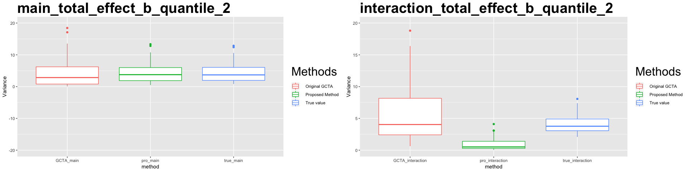
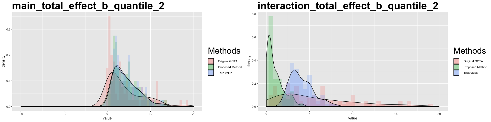
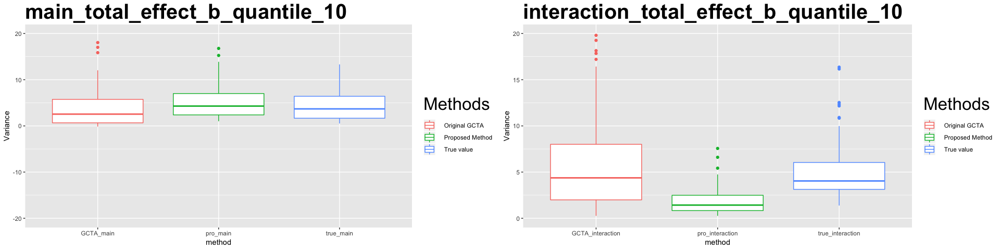
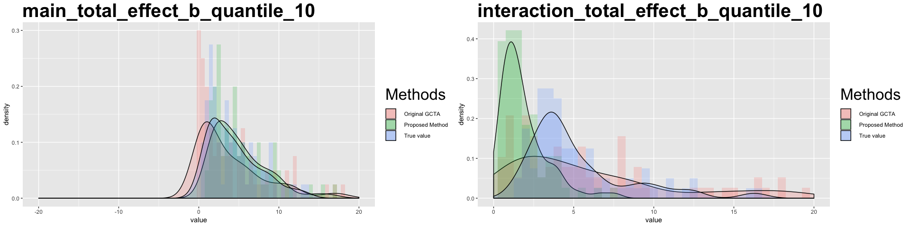

# Tranformation results 

# Simulation result on the subset of PCB data

## rank tranformation

<table class="table" style="width: auto !important; margin-left: auto; margin-right: auto;">
<caption>Table 1: MSE of estimated variance with 2 categories for each covariate</caption>
 <thead>
  <tr>
   <th style="text-align:left;">   </th>
   <th style="text-align:right;"> GCTA_main </th>
   <th style="text-align:right;"> GCTA_interaction </th>
   <th style="text-align:right;"> pro_main </th>
   <th style="text-align:right;"> pro_interaction </th>
  </tr>
 </thead>
<tbody>
  <tr>
   <td style="text-align:left;"> MSE </td>
   <td style="text-align:right;"> 3.408959 </td>
   <td style="text-align:right;"> 18.33851 </td>
   <td style="text-align:right;"> 0.1283685 </td>
   <td style="text-align:right;"> 13.50778 </td>
  </tr>
</tbody>
</table>

## Categorize into 5 levels

<table class="table" style="width: auto !important; margin-left: auto; margin-right: auto;">
<caption>Table 2: MSE of estimated variance with 5 categories for each covariate</caption>
 <thead>
  <tr>
   <th style="text-align:left;">   </th>
   <th style="text-align:right;"> GCTA_main </th>
   <th style="text-align:right;"> GCTA_interaction </th>
   <th style="text-align:right;"> pro_main </th>
   <th style="text-align:right;"> pro_interaction </th>
  </tr>
 </thead>
<tbody>
  <tr>
   <td style="text-align:left;"> MSE </td>
   <td style="text-align:right;"> 2.938123 </td>
   <td style="text-align:right;"> 16.81027 </td>
   <td style="text-align:right;"> 0.9044672 </td>
   <td style="text-align:right;"> 6.74494 </td>
  </tr>
</tbody>
</table>

## Categorize into 10 levels

<table class="table" style="width: auto !important; margin-left: auto; margin-right: auto;">
<caption>Table 3: MSE of estimated variance with 10 categories for each covariate</caption>
 <thead>
  <tr>
   <th style="text-align:left;">   </th>
   <th style="text-align:right;"> GCTA_main </th>
   <th style="text-align:right;"> GCTA_interaction </th>
   <th style="text-align:right;"> pro_main </th>
   <th style="text-align:right;"> pro_interaction </th>
  </tr>
 </thead>
<tbody>
  <tr>
   <td style="text-align:left;"> MSE </td>
   <td style="text-align:right;"> 3.083826 </td>
   <td style="text-align:right;"> 16.82068 </td>
   <td style="text-align:right;"> 1.702508 </td>
   <td style="text-align:right;"> 16.65901 </td>
  </tr>
</tbody>
</table>

