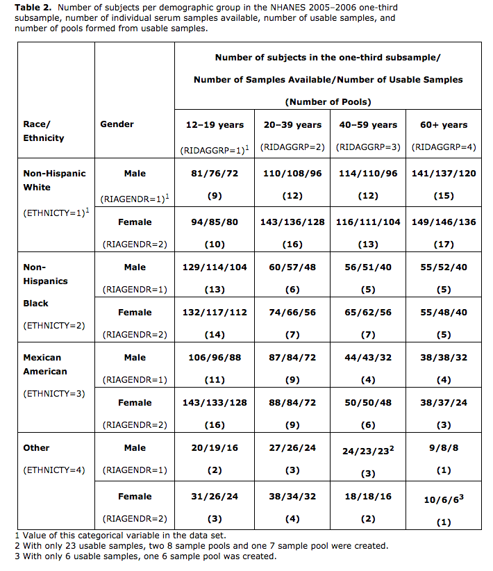

```{r setup, include=FALSE}
knitr::opts_chunk$set(echo = FALSE, 
                      comment = "", 
                      message = FALSE, 
                      warning = FALSE, 
                      echo = FALSE, 
                      fig.height = 5,
                      fig.width = 8,
                      tidy = TRUE,
                      tidy.opts=list(width.cutoff=100))

options(scipen=1, digits=2, width = 100)
library(MASS)
library(tidyverse)
require(gridExtra)

# heat map function for correlation matrxi

h_map <- function(x,cor = F) {
  if(cor == F){
    Cor <- cor(x) %>% abs(.)
  } else {
    Cor <- x %>% abs(.)
  }
    
  h1 <- ggplot(data = melt(Cor), aes(x=(Var1), y= (Var2), fill=value)) + 
    scale_fill_gradient(low = "white", high = "blue") +
    geom_tile() +
    theme(axis.text.x  = element_text(angle=90))
  h1
}
```


# PCBs data summary 
There are 3 surveys were conducted during the 6 years from 1999-2014. The number of PCBs which are measured are varied from each survey. Besides, the measurement sensitivity were improved along the time. There are some details of the PCBs measurements can be found in [__**this one**__](https://www.epa.gov/sites/production/files/2015-06/documents/ace3pcbreviewpackage3-02-11.pdf) at page 3. 

Another thing is the NHANES adopted a sub-sampling method after 2005 for PCBs measurements. It seems that they collect all the blood samples from all the subjects but they only chose a sub-sample of them to measure the PCBs value. The details of the pool sampling method can be found in this [__**this one**__](https://wwwn.cdc.gov/Nchs/Nhanes/2005-2006/PCBPOL_D.htm).
The basic idea is following:

1. Divide the whole subjects into 32 demographic groups   
2. For all the subjects in each demographic group, split them into pools with sample size around 8. Note that the number of pools are proportion to the total number of subjects in the demographic group.   
3. Draw a random sample from each pools, so that those sub-samples keeps same pattern in term of demographic groups ratio.    

The following is a summary table of sub-samples of 2005-2006 subjects' for getting PCBs measurements.


\newpage

Followings are some brief summary of the PCBs data. 

## 1999-2004

```{r, include=FALSE}
source("~/dev/projects/Chen_environmental_study/reports/proposed_GCTA_paper/est_var_analysis/est_combined_data/covaraites_summary_1999_2004.R")
```

The types of PCBs measured for each survey is 
```{r}
PCB_name_list
```

The common PCBs that were measured by each survey is 
```{r}
PCB_common
```
I will use those `r length(PCB_common)` PCBs to calculate their covariance matrix.

The total number of PCBs data from 1999-2004 is `r nrow(PCB_1999_2004_raw)`. After I remove all the missing data, what I get is total `r nrow(PCB_1999_2004_common)` observations. 


## 2005-2014
```{r, include=FALSE}
source("~/dev/projects/Chen_environmental_study/reports/proposed_GCTA_paper/est_var_analysis/est_combined_data/covaraites_summary_2005_2014.R")
```


The types of PCBs measured for each survey is 
```{r}
PCB_name_list
```

The common PCBs that were measured by each survey is 
```{r}
PCB_common
```
I will use those `r length(PCB_common)` PCBs to calculate their covariance matrix.

The total number of PCBs data from 2005-2014 is `r nrow(PCB_2005_2014_raw)`. After I remove all the missing data, what I get is total `r nrow(PCB_2005_2014_common)` observations. 

Note that I only work on the PCBs measurement without adjustment, but I used the under the limit adjustment.

# Some resource 
All the information of NHANES data could be found in their [__**webseit**__](https://wwwn.cdc.gov/nchs/nhanes/), all the information of PCBs are in the Laboratory data section, for example [__**webseit**__](https://wwwn.cdc.gov/Nchs/Nhanes/2001-2002/L28POC_B.htm). 

