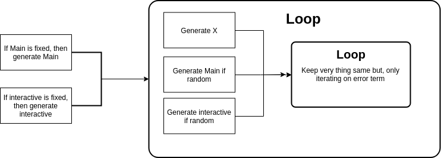

```{r setup, include=FALSE}
knitr::opts_chunk$set(echo = FALSE, comment = FALSE, message = FALSE, fig.height = 10)
```

# Motivation

Based on the previous simulations results, we found that the proposed method is able to work well on estimating the interactive effect in certain situation. However, because of the interaction terms the covariates cannot be __Independent__ anymore. Thus, we may need to conduct a series simulations with different setup in order to get a large picture of what situation the proposed method can work well.

# Background 

## GCTA method and proposed method

In the GCTA method, the author suggests that the causal covariates should be independent themselves and also be independent with non-causal covariates. Therefore, to ensure the GCTA method is able to work appropriately, we need to make sure the independence among the covariates. 

The approach of the proposed method is to uncorrelated the observed covariates by using a linear transformation, i.e. $Z = XA^{-1}$. Given $X \sim N(0, \Sigma)$, we can using the proposed method to get a independent covariates.  Thus, this method should work well when X's columns are correlated to each other, which is also supported by simulation results on the main effects with normal correlated distributions. 

How to reduce the correlation (the linear transformation) is important part of the proposed method. Because we want to the decorrelated the covariates so that they become independent. We don't want to pick up to much noise during the decorrelation procedure. This is not the main topic of this simulation, but we will do a more details study on the decorrelation. 

## Adding the interactive terms

### Issues

To estimating the interactive effects is more complicated than the main effects. 

\begin{align*}
Var(Y_i) &= Var(X_i^T\beta + X_i^T\Gamma X_i) + Var(\epsilon_i) \\
         &= Var(X_i^T\beta) + Var(X_i^T\Gamma X_i) + 2Cov(X_i^T\beta, X_i^T\Gamma X_i) + Var(\epsilon_i) \\
\end{align*}

1. There is an additional terms $Cov(X_i^T\beta, X_i^T\Gamma X_i)$
1. The main effect $X_i$ and $X_i X_j$ are not independent and cannot be independent anymore
1. In order to keep the variance structure, we can only apply the linear transformation on the main effects, not the interactive effects.   


### Solutions 

For the first issues, there are basic two different approach. 

1. If X or after some transformation follows normal distributions, then the $Cov(X_i^T\beta, X_i^T\Gamma X_i)$ will be zero. More specifically, as long as the 3rd moments are 0 the correlation of main and interactive effect should be zero.

1. If we assume $\beta's$ or $\Gamma's$ are independent random variables, then the correlation should also be round zero. 

For the second issues, the simulation suggests that the it can work well under the normal distribution setup. Thus, the main idea is to first transform the covariates into normal-like distribution and applied the proposed method.

# Simulation 

To get a better and larger picture of how well the proposed method's estimations, we conduct a series simulation with different setup. 

The main factors are  

1. Distribution of X  
1. Independence and Dependence of X  
1. Fixed or Random of main effect $\beta's$  
1. Fixed or Random of interaction effect $\Gamma's$   

## Simulation procedure


# X follows Normal distributions

```{r load normal graphs, include=FALSE}
source("./normal_correlated_fixed_random_graph.R")
```

If we can assume that X has normal distribution then the problem become more straightforward, because the correlation of main and interactive effects are zero.
Besides, we don't need to transform X in order to make it looks like a normal distribution.

## Independent 

Based on the previous simulation (from the Proposal), if X is normal and independent, then both proposed and original GCTA method can estimate the main and interaction effects well. This is indirectly suggest that the dependence between main and interactive may not be a big issue.

## Dependent (correlated)

If the X's are normal but correlated with each other, then it's not easy to estimate the interactive correctly. Based on previous simulation's results, the proposed method can work much better than the original GCTA when $\beta$, the main effect, is fixed. However when the main coefficients are not fixed then there is a big bias for the interaction estimation of proposed method. A guess is that if the $\beta$ is not linear transformation of may affect the $Var(X_i^T\Gamma X_i)$. 

### $\beta$ is fixed and $\Gamma$ is fixed 

The estimation and true values

\[
    Var(X_i^T\beta) = \beta^T \Sigma \beta
\]

\begin{align*}
    Var(X_i^T\Gamma X_i) = 2tr(\Gamma \Sigma \Gamma \Sigma) + 0
\end{align*}

Simulation result

```{r main_fixed_fixed_normal, fig.cap = "main effect of normal fixed main and interactoin"}

plot_fixed_fixed_main

```

```{r inter_fixed_fixed_normal, fig.cap = "interactive effect of normal fixed main and interactoin"}

plot_fixed_fixed_inter

```

\clearpage

### $\beta$ is fixed and $\Gamma$ is random 

\[
    Var(X_i^T\beta) = \beta^T \Sigma \beta
\]

\begin{align*}
    Var(X_i^T\Gamma X_i) &= E(Var(X_i^T\Gamma X_i|X_i = x_i)) + Var(E(X_i^T\Gamma X_i|X_i = x_i)) \\ 
                         &= E(Var(X_i^T\Gamma X_i|X_i = x_i))
\end{align*}

Simulation result

```{r main_fixed_random_normal, fig.cap = "main effect of normal fixed main and interactoin"}

plot_fixed_random_main

```

```{r inter_fixed_random_normal, fig.cap = "interactive effect of normal fixed main and interactoin"}

plot_fixed_random_inter

```

\clearpage

### $\beta$ is random and $\Gamma$ is random 

\begin{align*}
    Var(X_i^T\beta) &= E(Var(X_i^T\beta|X_i = x_i)) + Var(E(X_i^T\beta|X_i = x_i))\\
                    &= E(Var(X_i^T\beta|X_i = x_i)) + 0 \\
                    &= E(X_i^T \Sigma_{\beta} X_i)  \tag*{If $\Sigma_{\beta} = I_p$}\\
                    &= E(X_i^TX_i)
\end{align*}


\begin{align*}
    Var(X_i^T\Gamma X_i) &= E(Var(X_i^T\Gamma X_i|X_i = x_i)) + Var(E(X_i^T\Gamma X_i|X_i = x_i)) \\ 
                         &= E(Var(X_i^T\Gamma X_i|X_i = x_i))
\end{align*}

```{r main_random_random_normal, fig.cap = "main effect of normal fixed main and interactoin"}

plot_random_random_main

```

```{r inter_random_random_normal, fig.cap = "interactive effect of normal fixed main and interactoin"}

plot_random_random_inter

```

# Conclusion

# Further work 
