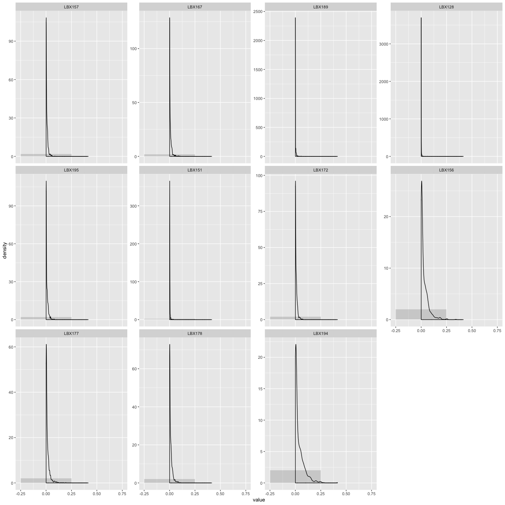
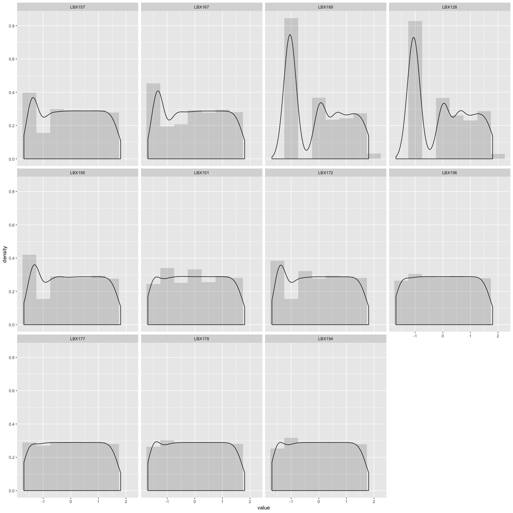
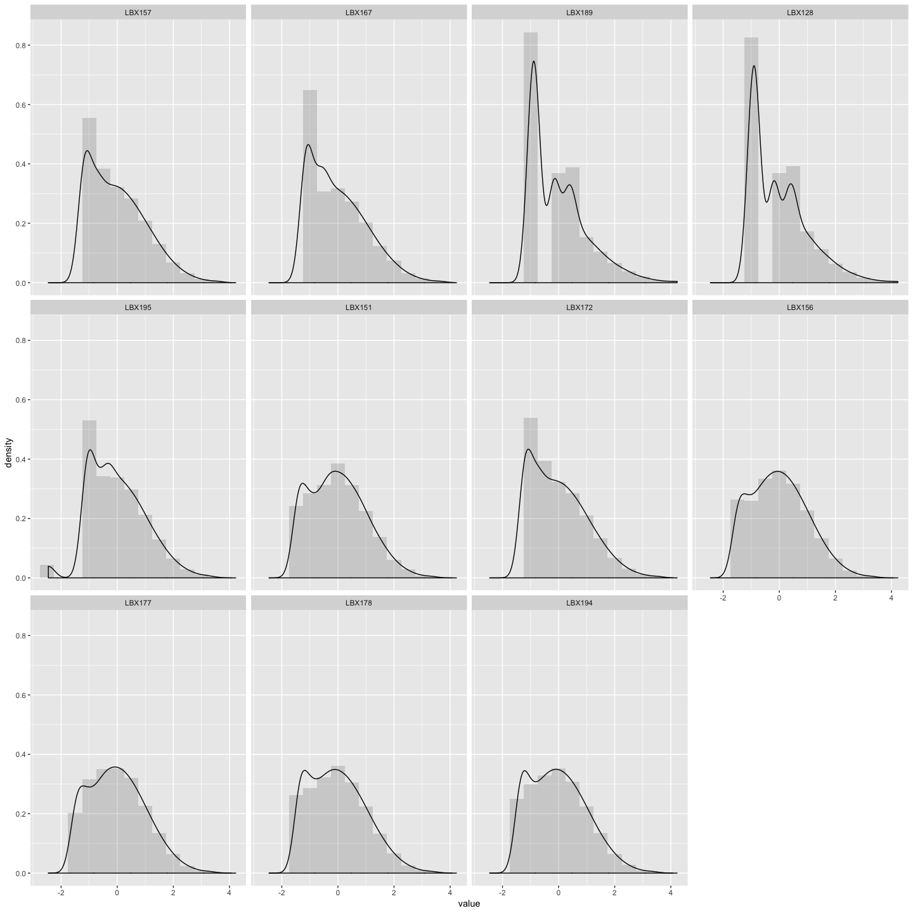
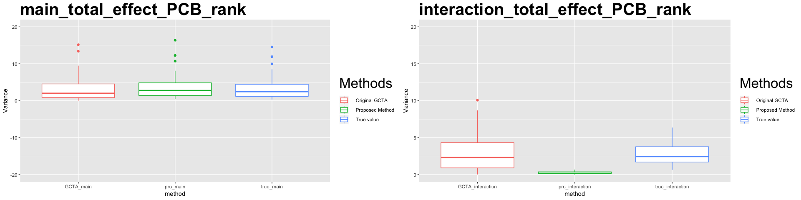
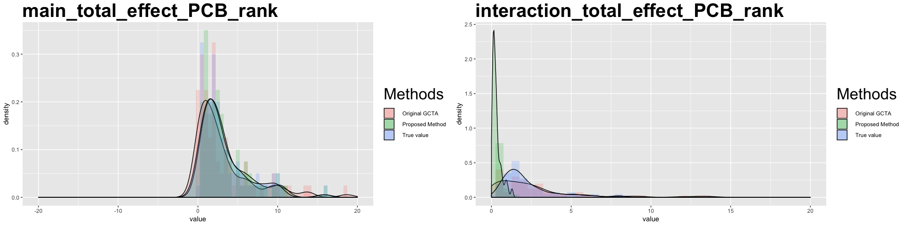
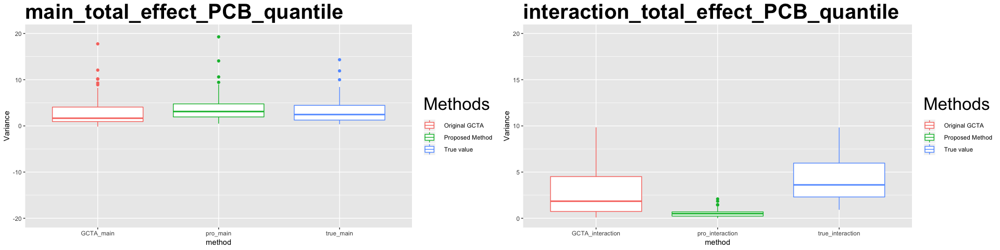
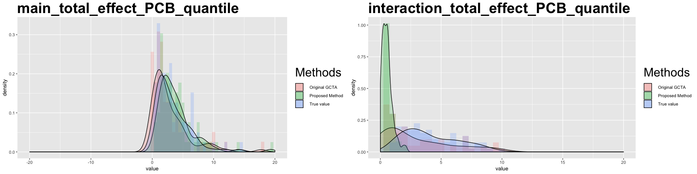
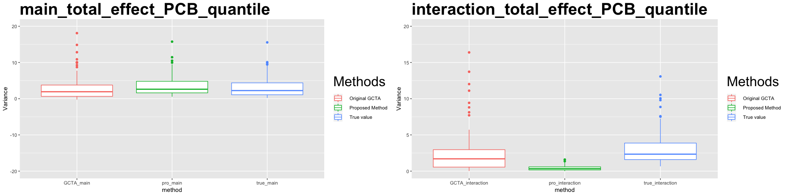
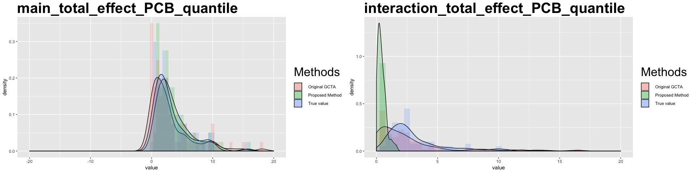

# Tranformation results 

The followings are the empirical density graphs of the covariates, which are selected based on their graphs shape. Those density graphs are not closed to a normal distribution

## Orignal scale

<!-- -->

## After the rank tranformation

<!-- -->

## After the normal quantile transformation
<!-- -->

# Simulation result on the subset of PCB data

## rank tranformation

### On PCB (removing 7 variables)

<table class="table" style="width: auto !important; margin-left: auto; margin-right: auto;">
<caption>Table 1: MSE of estimated variance under rank transformation</caption>
 <thead>
  <tr>
   <th style="text-align:left;">   </th>
   <th style="text-align:right;"> GCTA_main </th>
   <th style="text-align:right;"> GCTA_interaction </th>
   <th style="text-align:right;"> pro_main </th>
   <th style="text-align:right;"> pro_interaction </th>
  </tr>
 </thead>
<tbody>
  <tr>
   <td style="text-align:left;"> MSE </td>
   <td style="text-align:right;"> 2.374025 </td>
   <td style="text-align:right;"> 1.781549 </td>
   <td style="text-align:right;"> 0.1450366 </td>
   <td style="text-align:right;"> 10.26997 </td>
  </tr>
</tbody>
</table>

### On PCB (removing 11 variables)

<table class="table" style="width: auto !important; margin-left: auto; margin-right: auto;">
<caption>Table 2: MSE of estimated variance under rank transformation</caption>
 <thead>
  <tr>
   <th style="text-align:left;">   </th>
   <th style="text-align:right;"> GCTA_main </th>
   <th style="text-align:right;"> GCTA_interaction </th>
   <th style="text-align:right;"> pro_main </th>
   <th style="text-align:right;"> pro_interaction </th>
  </tr>
 </thead>
<tbody>
  <tr>
   <td style="text-align:left;"> MSE </td>
   <td style="text-align:right;"> 1.087262 </td>
   <td style="text-align:right;"> 1.894595 </td>
   <td style="text-align:right;"> 0.091419 </td>
   <td style="text-align:right;"> 6.977685 </td>
  </tr>
</tbody>
</table>

## Normal quantile tranformation with subset

### On PCB (removing 7 variables)

<table class="table" style="width: auto !important; margin-left: auto; margin-right: auto;">
<caption>Table 3: MSE of estimated variance under quantile transformation</caption>
 <thead>
  <tr>
   <th style="text-align:left;">   </th>
   <th style="text-align:right;"> GCTA_main </th>
   <th style="text-align:right;"> GCTA_interaction </th>
   <th style="text-align:right;"> pro_main </th>
   <th style="text-align:right;"> pro_interaction </th>
  </tr>
 </thead>
<tbody>
  <tr>
   <td style="text-align:left;"> MSE </td>
   <td style="text-align:right;"> 4.129354 </td>
   <td style="text-align:right;"> 3.128731 </td>
   <td style="text-align:right;"> 1.318495 </td>
   <td style="text-align:right;"> 17.81728 </td>
  </tr>
</tbody>
</table>

### On PCB (removing 11 variables)

<table class="table" style="width: auto !important; margin-left: auto; margin-right: auto;">
<caption>Table 4: MSE of estimated variance under quantile transformation</caption>
 <thead>
  <tr>
   <th style="text-align:left;">   </th>
   <th style="text-align:right;"> GCTA_main </th>
   <th style="text-align:right;"> GCTA_interaction </th>
   <th style="text-align:right;"> pro_main </th>
   <th style="text-align:right;"> pro_interaction </th>
  </tr>
 </thead>
<tbody>
  <tr>
   <td style="text-align:left;"> MSE </td>
   <td style="text-align:right;"> 1.341972 </td>
   <td style="text-align:right;"> 1.582012 </td>
   <td style="text-align:right;"> 0.5135139 </td>
   <td style="text-align:right;"> 13.8205 </td>
  </tr>
</tbody>
</table>

