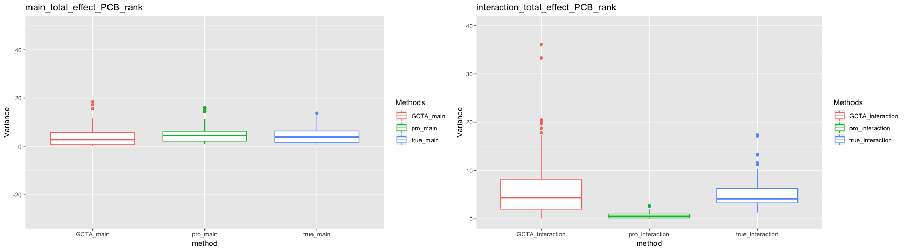
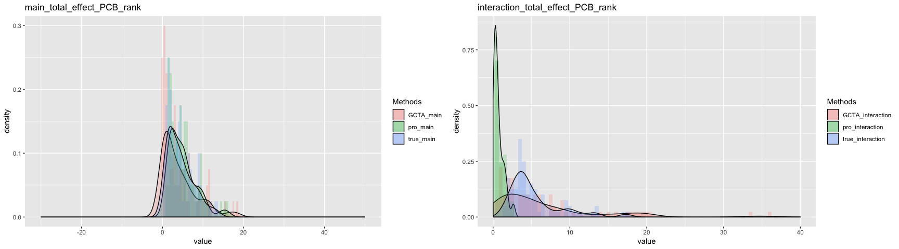
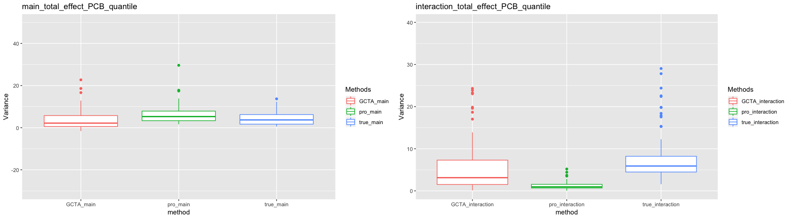
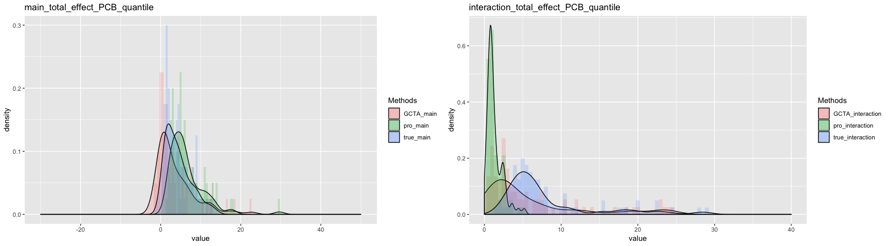
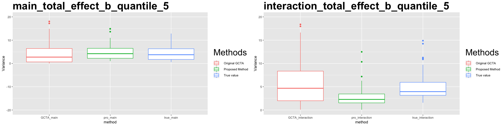
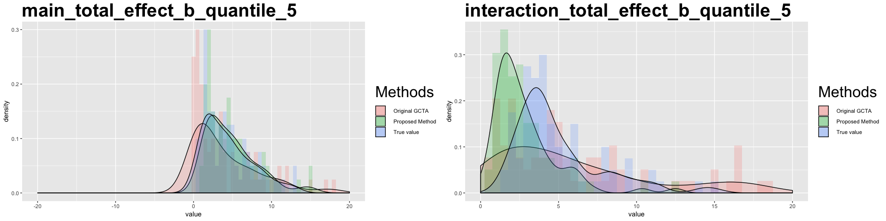
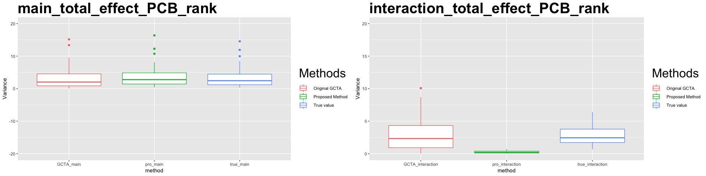
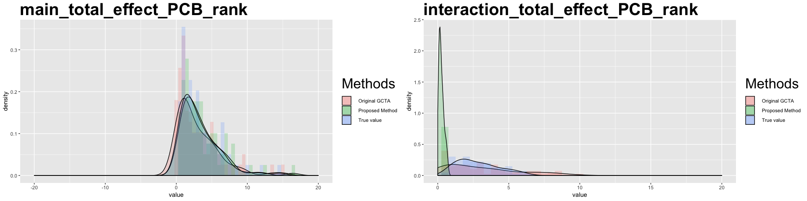

# Background of the environmental study

The overall goal of this study is to find the relation between chemical exposures and health outcome. Due to the complexity of the problem, we have to tackle the problem step by step. More specifically, we want to find a model to estimate the __cumulative(main)__, __interactive(interaction)__, and __separate__ effects.

# Estimation of the Cumulative (main) effect

Since the magnitudes of the covariates from the environmental study (e.g. PCB data) is small, the signal of the environmental factors will probably be weak. This situation is very similar with what we got in the __GWAS__ study. Therefore, it's natural to pick up the approaches used by GWAS studies. For example, the GCTA method. 

## GCTA method 

### Model

\[
  y_i = \beta_0 + \beta_{1}x_{i1}+\cdots+\beta_{m}x_{im} + \epsilon,    
\]

The matrix format is 

\[
  Y = X\beta + \epsilon,    
\]

- If $x's$ are standardized 
- and $x_{ij} \indep x_{ij'}, \forall j \neq j'$
- and independent from $\epsilon$, 
\[
  var(y) = var(\sum\beta_ix_i) + var(\epsilon) = \sum\beta^2_i + \sigma^2_{\epsilon} = \sigma^2_{\beta} + \sigma^2_{\epsilon}
\]
GCTA approach can estimate the $\sigma^2_\beta$ __unbiaslly__ without knowing the active causal set.  

## Proposed Method (__uncorrelating__)
To adopt GCTA approach, we need to transform the original data so that they are independent to each other. The transformation is actually a linear operation $Z = XA^{-1}$. There one of task of this study is to find an approparate matrix $A$.

In the proposal, SVD method is used to find the $A$. Although there is some concern for that method, it seems that the correlation problem can be solved well based on the simulation's result. There are high correlation among the environmental data, but the proposed method can estimate the main effect unbiaslly. 

### Model 

\[
  y_i = \alpha_0 + \alpha_{1}z_{i1}+\cdots+\alpha_{m}z_{im} + \epsilon,    
\]

The matrix format is 

\[
  Y = Z\alpha + \epsilon,    
\]
where $Z = XA^{-1}$ and $\alpha = A\beta$,

Then we have 

\[
  var(Z\alpha) = var(X\beta)
\]

# Estimation of the interactive effect

In this case, we're not only interested in the main effect but also in the interaction effect. It is possible that interaction effect also has a contribution to the response. Besides, under the environmental study, the total number of the covariates is much smaller than the GWAS study so that considering the the interaction is also feasible. 

## Model with interaction terms

\[
  y_i = \sum^m_{j = 1}x_j*\beta^{(main)}_j + \sum^{m(m-1)/2}_{j=1}x^{(inter)}_j\gamma^{(inter)}_j ~+~ \epsilon_i
\]

The variance of y could be decomposed as following:

\[
  var(y_i) = \sigma^2_{\beta} + \sigma^2_{\gamma} + \sigma^2_{\epsilon}
\]

## Issues of estimating the interaction effect

If consider to use the GCTA approach, there is a large bias on the estimation of the interaction effect. Based on the simulation results from the proposal, the marginal distribution of the covariates may have affected the proposed method's performance. It seems that it works well under the normal distribution even give the correlation structure between covariates. 

## How does the covariate's distribution affect the result? 
To check what influence of the normality will have on the performance, I conduct several simulations studying which includes transforming and selecting the covariates. 

### Transformation
Since the data is right skewed, I consider log and square root transformation.  Besides, I also consider the rank and normal quantile transformation. Categorized transformation is also used to improve the normality

Based on the simulation results, Categorized transformation seems to __reduce__ the biasness of the proposed method when estimating interaction

### simulation result
Basically, all the transformation methods improve the performance. However, the bias issue is still not solved, especially for the proposed method.  

Following is the result of rank and normal quantile transformation. For the graphs you can tell that the proposed method still has bias after the transformation

#### Rank

#### Normal quantile

#### Categorized into 5 levels

\newpage

### Subset
To further improve the normality, I just remove several covariates which have a very un-symmetric empirical pdf (even after normal transformation). Therefore, after this step,  most of the covariates should have a nice symmteric bell-shape distribution.  

#### simulation result

## Questions 
1. Since we consider the interaction terms, the covariates cannot be independent any more
2. Interaction terms are also not standardized, which means that the $E(x^{(inter)}) \neq 0$
3. What's will be the sparsity of the interaction terms?

# Further work
