# Transformation methods

- Based the density and histogram plots, the most of the empirical distributions of individual PCB covariate are __right__ skewed (heavy tail)
- I have tried 5 different transformation methods  `square root`, `log`, `box-cox`, `rank` and `quantile`
- Transformation is made __BEFORE__ generating the main and interaction signals

# Simulation and Models
\[
  y_i = \sum^m_{j = 1}z_j\beta^{(main)}_j + \sum^{m(m-1)/2}_{k=2}z^{(inter)}_k\beta^{(inter)}_k ~+~ \epsilon_i
\]

- Where $\beta^{(main)} \sim N(0, 0.5)$ and $\beta^{(intercation)} \sim N(0,0.1)$ are random effects
- During the simulation, the interaction coefficients are not zero and generated from a normal distribution
- For main and interaction effects ($\beta^{(main)}$ and $\beta^{(inter)}$), 80 groups of values are randomly generated
- Given a fixed main and interaction effect, responses are generated 20 times in order to get a averaged estimators of main and interaction variance
- For all of the following results, the model is same. 

# Steps
1. All 5 transformation methods are applied to the PCB data directly
2. Standardizing the transformed data into Z, where $E(Z_j) = 0, Var(Z_i) = 1$
3. For the proposed method, the input data Z is also transformed into __Uncorrelated__ by SVD method
4. Using the RMEL method to estimated the variances of main effect and interact effect

# Simulation Result for each method

- The following tables are about the MSE of estimated variance (averaging across different values of $\beta's$ )
- Histogram plots are about the empirical distribution of the true variances, GCTA estimator and Proposed estimator

## No transformation
- In this case, no transformation is applied to PCB data. This could be considered as a reference result

<table class="table" style="width: auto !important; margin-left: auto; margin-right: auto;">
<caption>Table 1: MSE of estimated varaince under original scale</caption>
 <thead>
  <tr>
   <th style="text-align:left;">   </th>
   <th style="text-align:right;"> GCTA_main </th>
   <th style="text-align:right;"> GCTA_interaction </th>
   <th style="text-align:right;"> pro_main </th>
   <th style="text-align:right;"> pro_interaction </th>
  </tr>
 </thead>
<tbody>
  <tr>
   <td style="text-align:left;"> MSE </td>
   <td style="text-align:right;"> 266.2846 </td>
   <td style="text-align:right;"> 2368.102 </td>
   <td style="text-align:right;"> 410.8968 </td>
   <td style="text-align:right;"> 2398.617 </td>
  </tr>
</tbody>
</table>
- In the Table 1, "GCTA_main" and "GCTA_interaction" stands for the estimation of GCTA method. 
- "pro_main" and "pro_interaction" stand for the estimation of proposed method. 
- MSE is calculated by $\sum(\sigma^2_{estimation} - \sigma^2_{true})^2/n$
- n in our case is 80

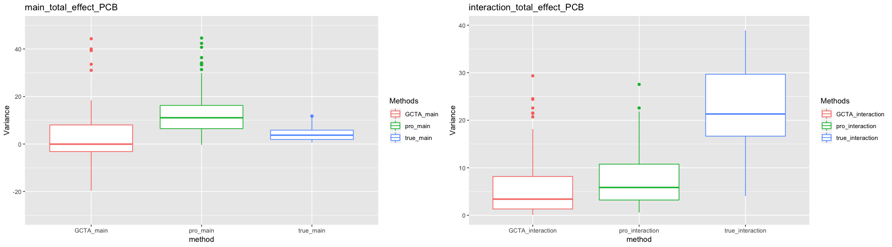

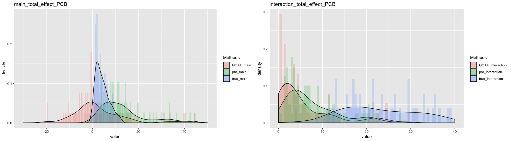

- In figure 2, left hand-side is the histogram of main effect variance and right hand-side is for interaction effect variance. 
- GCTA_main (in pink) represents the estimated main effect's variance by GCTA method 
- pro_main (in green) represents the estimated main effect's variance by proposed method which is GCTA method with uncorrelated procedure
- True_main (in blue) represents the real variance of the main effect  
- It seems that the there is a bias for both GCTA and proposed estimators of interaction effect

## Square root transformation

- In this case, square root transformation is applied to PCB data. 

<table class="table" style="width: auto !important; margin-left: auto; margin-right: auto;">
<caption>Table 2: MSE of estimated variance under square root transformation</caption>
 <thead>
  <tr>
   <th style="text-align:left;">   </th>
   <th style="text-align:right;"> GCTA_main </th>
   <th style="text-align:right;"> GCTA_interaction </th>
   <th style="text-align:right;"> pro_main </th>
   <th style="text-align:right;"> pro_interaction </th>
  </tr>
 </thead>
<tbody>
  <tr>
   <td style="text-align:left;"> MSE </td>
   <td style="text-align:right;"> 45.84904 </td>
   <td style="text-align:right;"> 112.6256 </td>
   <td style="text-align:right;"> 101.551 </td>
   <td style="text-align:right;"> 218.4397 </td>
  </tr>
</tbody>
</table>

- In the Table 2, MSE is reduced by using square root transformation but not as much as log or cox-box transformation

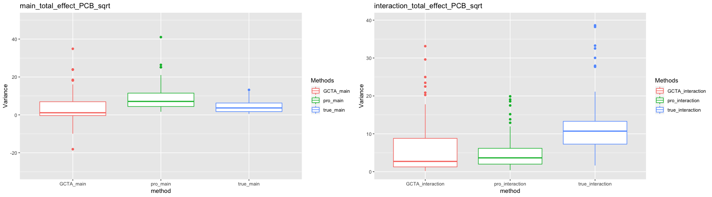

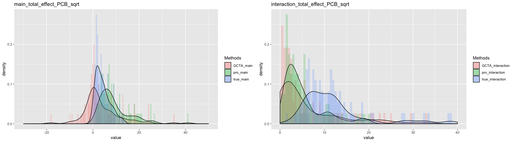

- In the figure 4, the histogram is similar with the original scale data's result

## Log transformation
- In this case, $log$ transformation applied to each column of PCB data.

<table class="table" style="width: auto !important; margin-left: auto; margin-right: auto;">
<caption>Table 3: MSE of estimated variance under log transformation</caption>
 <thead>
  <tr>
   <th style="text-align:left;">   </th>
   <th style="text-align:right;"> GCTA_main </th>
   <th style="text-align:right;"> GCTA_interaction </th>
   <th style="text-align:right;"> pro_main </th>
   <th style="text-align:right;"> pro_interaction </th>
  </tr>
 </thead>
<tbody>
  <tr>
   <td style="text-align:left;"> MSE </td>
   <td style="text-align:right;"> 5.954494 </td>
   <td style="text-align:right;"> 20.23115 </td>
   <td style="text-align:right;"> 10.26544 </td>
   <td style="text-align:right;"> 60.04482 </td>
  </tr>
</tbody>
</table>

- In the Table 3, Log transformation reduce the MSE a lot
- However, at least based on this simulation result GCTA method's result is better than proposed method

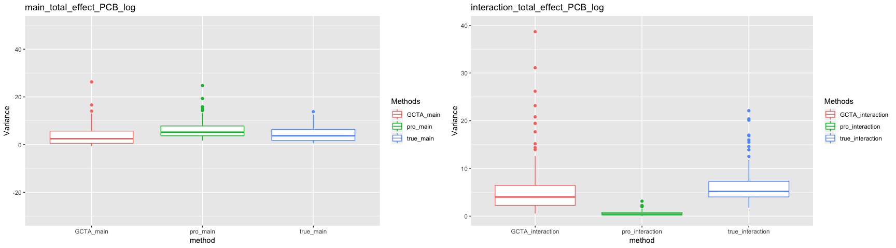

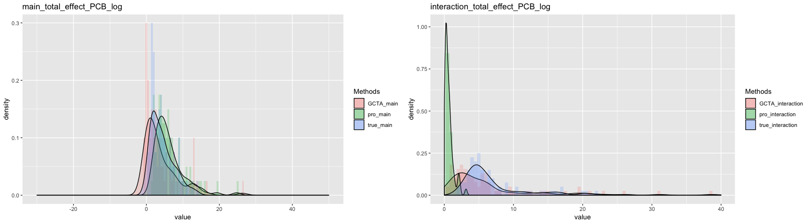

- In figure 6,after transformation both methods can predict the main effect well

- But for the interaction effect, the proposed method seems to have a bias which I will make a further study.

## Cox-Box transformation
- In this case, Cox-Box transformation is applied to each column of PCB data.
\[
 y(\lambda)=\begin{cases}
               \frac{y^\lambda - 1}{\lambda}, \lambda \neq 0\\
               log{(y)} , \lambda = 0
            \end{cases}
\]
- The choosing of $\lambda$ is based on a linear model $y = \beta_0$, where $\beta_0$ is the intercept.

<table class="table" style="width: auto !important; margin-left: auto; margin-right: auto;">
<caption>Table 4: MSE of estimated variance under cox-box transformation</caption>
 <thead>
  <tr>
   <th style="text-align:left;">   </th>
   <th style="text-align:right;"> GCTA_main </th>
   <th style="text-align:right;"> GCTA_interaction </th>
   <th style="text-align:right;"> pro_main </th>
   <th style="text-align:right;"> pro_interaction </th>
  </tr>
 </thead>
<tbody>
  <tr>
   <td style="text-align:left;"> MSE </td>
   <td style="text-align:right;"> 6.421662 </td>
   <td style="text-align:right;"> 20.55529 </td>
   <td style="text-align:right;"> 10.85164 </td>
   <td style="text-align:right;"> 61.49594 </td>
  </tr>
</tbody>
</table>

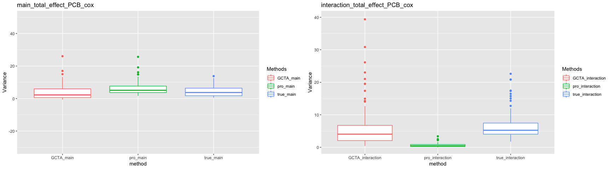

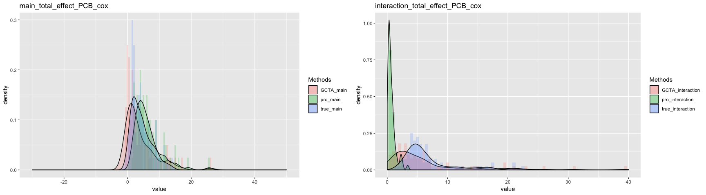

- The result is similar with log transformation's result

## Rank tranformation

- In this case, the ranks of each covariate are used to replace real values.

<table class="table" style="width: auto !important; margin-left: auto; margin-right: auto;">
<caption>Table 5: MSE of estimated variance under rank transformation</caption>
 <thead>
  <tr>
   <th style="text-align:left;">   </th>
   <th style="text-align:right;"> GCTA_main </th>
   <th style="text-align:right;"> GCTA_interaction </th>
   <th style="text-align:right;"> pro_main </th>
   <th style="text-align:right;"> pro_interaction </th>
  </tr>
 </thead>
<tbody>
  <tr>
   <td style="text-align:left;"> MSE </td>
   <td style="text-align:right;"> 2.76953 </td>
   <td style="text-align:right;"> 16.21967 </td>
   <td style="text-align:right;"> 1.309832 </td>
   <td style="text-align:right;"> 33.63216 </td>
  </tr>
</tbody>
</table>
- In the Table 5, MSE is reduced by using rank transformation. 
- Compared with other methods, Using rank transformation seems to give the __BEST__ result in term of MSE

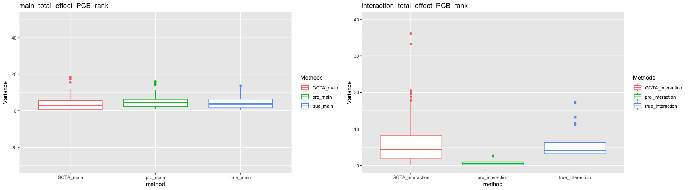

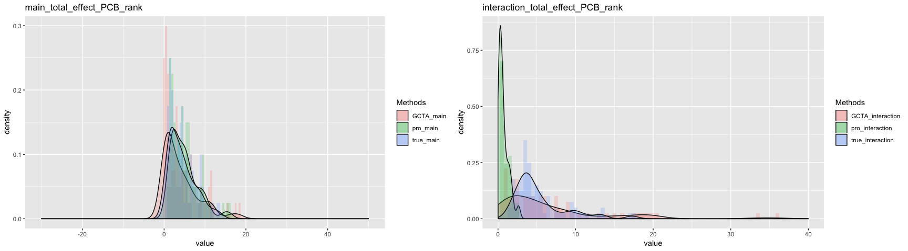

- In the figure 10, for the main effect, both GCTA and proposed methods are able to give a good estimations for the signals' variance. 
- However, for the interaction effect, the proposed method seems to have a bias in estimating the interaction variance. 

## Normal Quantile tranformation
- In this case, normal quantile are used the replace the original value for each variable of PCB data

* the Normal quantile Procedure is 
    1. Calculate the empirical precentails for each column of PCB data 
    1. Using the precentails to find the corresponding quantile value based on a Standard Normal distribution.
    1. Using the normal quantiles to replace the real values of PCB data column by column 

<table class="table" style="width: auto !important; margin-left: auto; margin-right: auto;">
<caption>Table 6: MSE of estimated variance under quantile transformation</caption>
 <thead>
  <tr>
   <th style="text-align:left;">   </th>
   <th style="text-align:right;"> GCTA_main </th>
   <th style="text-align:right;"> GCTA_interaction </th>
   <th style="text-align:right;"> pro_main </th>
   <th style="text-align:right;"> pro_interaction </th>
  </tr>
 </thead>
<tbody>
  <tr>
   <td style="text-align:left;"> MSE </td>
   <td style="text-align:right;"> 8.535776 </td>
   <td style="text-align:right;"> 16.1687 </td>
   <td style="text-align:right;"> 14.83352 </td>
   <td style="text-align:right;"> 75.22636 </td>
  </tr>
</tbody>
</table>

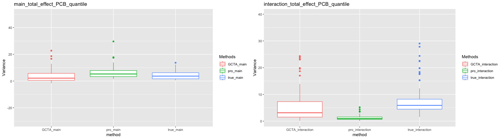

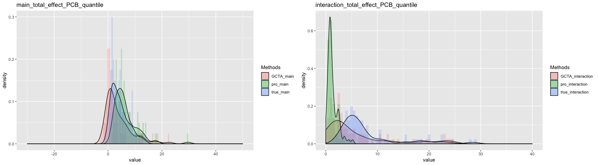
