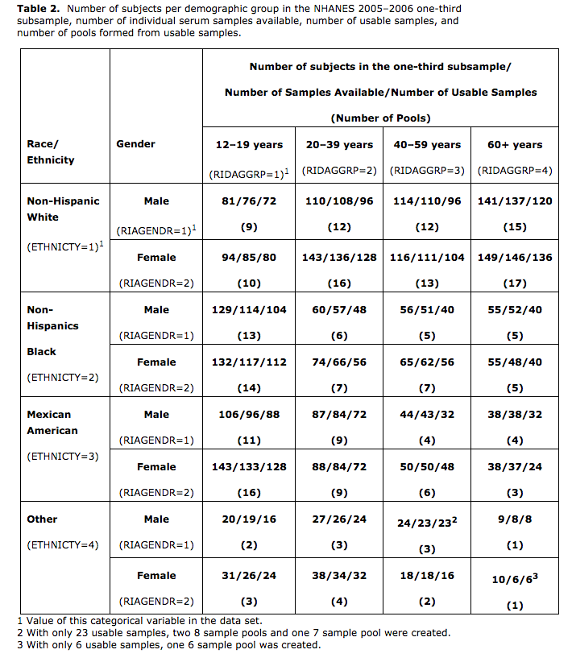

```{r setup, include=FALSE}
knitr::opts_chunk$set(echo = FALSE, comment = "", message = FALSE, warning = FALSE, fig.height = 10)
library(MASS)
library(tidyverse)
require(gridExtra)

# heat map function for correlation matrxi

h_map <- function(x,cor = F) {
  if(cor == F){
    Cor <- cor(x) %>% abs(.)
  } else {
    Cor <- x %>% abs(.)
  }
    
  h1 <- ggplot(data = melt(Cor), aes(x=(Var1), y= (Var2), fill=value)) + 
    scale_fill_gradient(low = "white", high = "blue") +
    geom_tile() +
    theme(axis.text.x  = element_text(angle=90))
  h1
}
```

# Motivation

The sample covariates matrix of PCBs is unstructured and dense, so it is not straightforward to estimate a large, non-spare covariance matrix directly. One possible solution is to borrow the information from histrocial data or data from other studies with different responses but similar covariates. The report is to investigate the covariance matrix across all the available PCBs data from NHANES from 1999 - 2014. We are trying to see if there is common structure among all different surveies or within certain subgroups.

## Decorrelation using histrocial data 

### Decorrelation steps 

Let X be the covariates and the $\hat{\Sigma}_X = \frac{1}{n-1}(X - \bar{X})^T(X - \bar{X})$. Assume that there is a matrix A that we could used for decorrelation. 

\[
Z = XA \Rightarrow \hat{\Sigma}_Z = \frac{1}{n-1} (Z - \bar{X})^T(Z - \bar{Z}) =  A^T\hat{\Sigma}_XA
\]


# PCBs data summary and covariance-correlation structure

## 1999-2004

```{r, include=FALSE}
source("~/dev/projects/Chen_environmental_study/reports/proposed_GCTA_paper/est_var_analysis/est_combined_data/covaraites_summary_1999_2004.R")
```
There are 3 surveys were conducted during the 6 years. However, based on the data I collected, the types of PCBs are not extact same accross the 3 surveys. Followings are some facts.

The types of PCBs measured for each survey is 
```{r}
PCB_name_list
```

The common PCBs that were measured by each survey is 
```{r}
PCB_common
```
I will use those `r length(PCB_common)` PCBs to calculate their covariance matrix.

The total number of PCBs data from 1999-2004 is `r nrow(PCB_1999_2004_raw)`. After I remove all the missing data, what I get is total `r nrow(PCB_1999_2004_common)` observations. 

Note that I only work on the PCBs measurement without adjustment, but I used the under the limit adjustment.

### time
Followings are 3 heat-maps of correlation-matrix across the 3 surveys. In general, they have high correlations among those PCBs. But they do show some common pattern. 

The number of observation across each survey is 

```{r}
PCB_1999_2004_common[,.N, by = SDDSRVYR]
```

```{r, fig.cap = "1999-2000"}
grid.arrange(h_map(PCB_1999_2004_common[SDDSRVYR == 1, ..PCB_common]),
             h_map(data.matrix(PCB_1999_2004_common[SDDSRVYR == 1, ..PCB_common]) %*% invsqrt(cov_1999_2004)), 
             ncol=2,
             respect=TRUE)
```

```{r, fig.cap = "Combined main and interaction 1999-2000"}
grid.arrange(h_map(Combined_PCB_1999_2004_common[SDDSRVYR == 1, ..Combined_PCB_common]),
             h_map(data.matrix(Combined_PCB_1999_2004_common[SDDSRVYR == 1, ..Combined_PCB_common]) %*% invsqrt(Combined_cov_1999_2004)), 
             ncol=2,
             respect=TRUE)
```

```{r, fig.cap = "2001-2002"}
grid.arrange(h_map(PCB_1999_2004_common[SDDSRVYR == 2, ..PCB_common]),
             h_map(data.matrix(PCB_1999_2004_common[SDDSRVYR == 2, ..PCB_common]) %*% invsqrt(cov_1999_2004)), 
             ncol=2,
             respect=TRUE)
```

```{r, fig.cap = "Combined main and interaction 2001-2002"}
grid.arrange(h_map(Combined_PCB_1999_2004_common[SDDSRVYR == 2, ..Combined_PCB_common]),
             h_map(data.matrix(Combined_PCB_1999_2004_common[SDDSRVYR == 2, ..Combined_PCB_common]) %*% invsqrt(Combined_cov_1999_2004)), 
             ncol=2,
             respect=TRUE)
```

```{r, fig.cap = "2003-2004"}
grid.arrange(h_map(PCB_1999_2004_common[SDDSRVYR == 3, ..PCB_common]),
             h_map(data.matrix(PCB_1999_2004_common[SDDSRVYR == 3, ..PCB_common]) %*% invsqrt(cov_1999_2004)), 
             ncol=2,
             respect=TRUE)
```


```{r, fig.cap = "Combined main and interaction 1993-2004"}
grid.arrange(h_map(Combined_PCB_1999_2004_common[SDDSRVYR == 3, ..Combined_PCB_common]),
             h_map(data.matrix(Combined_PCB_1999_2004_common[SDDSRVYR == 3, ..Combined_PCB_common]) %*% invsqrt(Combined_cov_1999_2004)), 
             ncol=2,
             respect=TRUE)
```

### gender
Followings are the heat-maps of correlation-matrix for different gender


```{r, fig.cap = "Male"}
grid.arrange(h_map(PCB_1999_2004_common[RIAGENDR == 1, ..PCB_common]),
             h_map(data.matrix(PCB_1999_2004_common[RIAGENDR == 1, ..PCB_common]) %*% invsqrt(cov_1999_2004)), 
             ncol=2,
             respect = TRUE)
```


```{r, fig.cap = "Combined main and interaction Male"}
grid.arrange(h_map(Combined_PCB_1999_2004_common[RIAGENDR == 1, ..Combined_PCB_common]),
             h_map(data.matrix(Combined_PCB_1999_2004_common[RIAGENDR == 1, ..Combined_PCB_common]) %*% invsqrt(Combined_cov_1999_2004)), 
             ncol=2,
             respect = TRUE)
```

```{r, fig.cap = "Female"}
grid.arrange(h_map(PCB_1999_2004_common[RIAGENDR == 2, ..PCB_common]),
             h_map(data.matrix(PCB_1999_2004_common[RIAGENDR == 2, ..PCB_common]) %*% invsqrt(cov_1999_2004)), 
             ncol=2,
             respect = TRUE)
```

```{r, fig.cap = "Combined main and interaction Female"}
grid.arrange(h_map(Combined_PCB_1999_2004_common[RIAGENDR == 2, ..Combined_PCB_common]),
             h_map(data.matrix(Combined_PCB_1999_2004_common[RIAGENDR == 2, ..Combined_PCB_common]) %*% invsqrt(Combined_cov_1999_2004)), 
             ncol=2,
             respect = TRUE)
```

## 2005-2014

```{r, include=FALSE}
source("~/dev/projects/Chen_environmental_study/reports/proposed_GCTA_paper/est_var_analysis/est_combined_data/covaraites_summary_2005_2014.R")
```

### the pooled-sample
NHANES adapted a pooled sampling method to collect the PCBs data since 2005. It seems that they collect all the blood samples from all the subjects but they only chose a sub-sample of them to measure the PCBs value.
The basic idea is following:

1. Divide the whole subjects into 32 demographic groups   
2. For all the subjects in each demographic group, split them into pools with sample size around 8. Note that the number of pools are proportion to the total number of subjects in the demographic group.   
3. Draw a random sample from each pools, so that those sub-samples keeps same pattern in term of demographic groups ratio.    

The follwoing is a summary table of sub-samples of 2005-2006 subjects' for getting PCBs measurements.


The types of PCBs measured for each survey is 
```{r}
PCB_name_list
```

The common PCBs that were measured by each survey is 
```{r}
PCB_common
```
I will use those `r length(PCB_common)` PCBs to calculate their covariance matrix.

The total number of PCBs data from 2005-2014 is `r nrow(PCB_2005_2014_raw)`. After I remove all the missing data, what I get is total `r nrow(PCB_2005_2014_common)` observations. 

Note that I only work on the PCBs measurement without adjustment, but I used the under the limit adjustment.

\newpage

### time
Followings are 5 heat-maps of correlation-matrix across the 3 surveys. In general, they have high correlations among those PCBs. But they do show some common pattern. 

The number of observation across each survey is 
```{r}
PCB_2005_2014_common[,.N, by = SDDSRVYR]
```

\newpage 

```{r, fig.cap = "2005-2006"}
grid.arrange(h_map(PCB_2005_2014_common[SDDSRVYR == 4, ..PCB_common]),
             h_map(data.matrix(PCB_2005_2014_common[SDDSRVYR == 4, ..PCB_common]) %*% invsqrt(cov_2005_2014)), 
             ncol=2,
             respect=TRUE)
```

```{r, fig.cap = "Combined main and interaction 2005-2006"}
grid.arrange(h_map(Combined_PCB_2005_2014_common[SDDSRVYR == 4, ..Combined_PCB_common]),
             h_map(data.matrix(Combined_PCB_2005_2014_common[SDDSRVYR == 4, ..Combined_PCB_common]) %*% invsqrt(Combined_cov_2005_2014)), 
             ncol=2,
             respect=TRUE)
```

```{r, fig.cap = "2007-2008"}
grid.arrange(h_map(PCB_2005_2014_common[SDDSRVYR == 5, ..PCB_common]),
             h_map(data.matrix(PCB_2005_2014_common[SDDSRVYR == 5, ..PCB_common]) %*% invsqrt(cov_2005_2014)), 
             ncol=2,
             respect=TRUE)
```

```{r, fig.cap = "Combined main and interaction 2007-2008"}
grid.arrange(h_map(Combined_PCB_2005_2014_common[SDDSRVYR == 5, ..Combined_PCB_common]),
             h_map(data.matrix(Combined_PCB_2005_2014_common[SDDSRVYR == 5, ..Combined_PCB_common]) %*% invsqrt(Combined_cov_2005_2014)), 
             ncol=2,
             respect=TRUE)
```

```{r, fig.cap = "2009-2010"}
grid.arrange(h_map(PCB_2005_2014_common[SDDSRVYR == 6, ..PCB_common]),
             h_map(data.matrix(PCB_2005_2014_common[SDDSRVYR == 6, ..PCB_common]) %*% invsqrt(cov_2005_2014)), 
             ncol=2,
             respect=TRUE)
```

```{r, fig.cap = "Combined main and interaction 2009-2010"}
grid.arrange(h_map(Combined_PCB_2005_2014_common[SDDSRVYR == 6, ..Combined_PCB_common]),
             h_map(data.matrix(Combined_PCB_2005_2014_common[SDDSRVYR == 6, ..Combined_PCB_common]) %*% invsqrt(Combined_cov_2005_2014)), 
             ncol=2,
             respect=TRUE)
```

```{r, fig.cap = "2011-2012"}
grid.arrange(h_map(PCB_2005_2014_common[SDDSRVYR == 7, ..PCB_common]),
             h_map(data.matrix(PCB_2005_2014_common[SDDSRVYR == 7, ..PCB_common]) %*% invsqrt(cov_2005_2014)), 
             ncol=2,
             respect=TRUE)
```

```{r, fig.cap = "Combined main and interaction 2011-2012"}
grid.arrange(h_map(Combined_PCB_2005_2014_common[SDDSRVYR == 7, ..Combined_PCB_common]),
             h_map(data.matrix(Combined_PCB_2005_2014_common[SDDSRVYR == 7, ..Combined_PCB_common]) %*% invsqrt(Combined_cov_2005_2014)), 
             ncol=2,
             respect=TRUE)
```

```{r, fig.cap = "2013-2014"}
grid.arrange(h_map(PCB_2005_2014_common[SDDSRVYR == 8, ..PCB_common]),
             h_map(data.matrix(PCB_2005_2014_common[SDDSRVYR == 8, ..PCB_common]) %*% invsqrt(cov_2005_2014)), 
             ncol=2,
             respect=TRUE)
```

```{r, fig.cap = "Combined main and interaction 2013-2014"}
grid.arrange(h_map(Combined_PCB_2005_2014_common[SDDSRVYR == 8, ..Combined_PCB_common]),
             h_map(data.matrix(Combined_PCB_2005_2014_common[SDDSRVYR == 8, ..Combined_PCB_common]) %*% invsqrt(Combined_cov_2005_2014)), 
             ncol=2,
             respect=TRUE)
```
### gender
Followings are the heat-maps of correlation-matrix for different gender

```{r, fig.cap = "Male"}
grid.arrange(h_map(PCB_2005_2014_common[ RIAGENDR== 1, ..PCB_common]),
             h_map(data.matrix(PCB_2005_2014_common[RIAGENDR == 1, ..PCB_common]) %*% invsqrt(cov_2005_2014)), 
             ncol=2,
             respect=TRUE)
```

```{r, fig.cap = "Combined main and interaction Male"}
grid.arrange(h_map(Combined_PCB_2005_2014_common[ RIAGENDR== 1, ..Combined_PCB_common]),
             h_map(data.matrix(Combined_PCB_2005_2014_common[RIAGENDR == 1, ..Combined_PCB_common]) %*% invsqrt(Combined_cov_2005_2014)), 
             ncol=2,
             respect=TRUE)
```

```{r, fig.cap = "Female"}
grid.arrange(h_map(PCB_2005_2014_common[ RIAGENDR== 2, ..PCB_common]),
             h_map(data.matrix(PCB_2005_2014_common[RIAGENDR == 2, ..PCB_common]) %*% invsqrt(cov_2005_2014)), 
             ncol=2,
             respect=TRUE)
```

```{r, fig.cap = "Combined main and interaction Female"}
grid.arrange(h_map(Combined_PCB_2005_2014_common[ RIAGENDR== 2, ..Combined_PCB_common]),
             h_map(data.matrix(Combined_PCB_2005_2014_common[RIAGENDR == 2, ..Combined_PCB_common]) %*% invsqrt(Combined_cov_2005_2014)), 
             ncol=2,
             respect=TRUE)
```
<!-- ## 1999-2014 -->
<!-- If we only look at the PCBs that is common across those 16 years surveys.  -->
<!-- ```{r} -->
<!-- PCB_common_1999_2014 <- intersect(PCB_common_1999, PCB_common_2005) -->
<!-- PCB_common_1999_2014 -->
<!-- ``` -->

<!-- ```{r, fig.cap = "1999-2000"} -->
<!-- h_map(PCB_1999_2004_common[SDDSRVYR == 1, ..PCB_common_1999_2014]) -->
<!-- ``` -->

<!-- ```{r, fig.cap = "2001-2002"} -->
<!-- h_map(PCB_1999_2004_common[SDDSRVYR == 2, ..PCB_common_1999_2014]) -->
<!-- ``` -->

<!-- ```{r, fig.cap = "2003-2004"} -->
<!-- h_map(PCB_1999_2004_common[SDDSRVYR == 3, ..PCB_common_1999_2014]) -->
<!-- ``` -->

<!-- ```{r, fig.cap = "2005-2006"} -->
<!-- h_map(PCB_2005_2014_common[SDDSRVYR == 4, ..PCB_common_1999_2014]) -->
<!-- ``` -->

<!-- ```{r, fig.cap = "2007-2008"} -->
<!-- h_map(PCB_2005_2014_common[SDDSRVYR == 5, ..PCB_common_1999_2014]) -->
<!-- ``` -->

<!-- ```{r, fig.cap = "2009-2010"} -->
<!-- h_map(PCB_2005_2014_common[SDDSRVYR == 6, ..PCB_common_1999_2014]) -->
<!-- ``` -->

<!-- ```{r, fig.cap = "2011-2012"} -->
<!-- h_map(PCB_2005_2014_common[SDDSRVYR == 7, ..PCB_common_1999_2014]) -->
<!-- ``` -->

<!-- ```{r, fig.cap = "2013-2014"} -->
<!-- h_map(PCB_2005_2014_common[SDDSRVYR == 8, ..PCB_common_1999_2014]) -->
<!-- ``` -->


