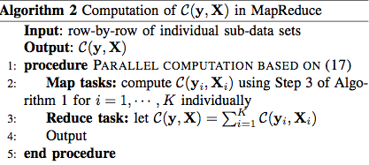

---
nocite: | 
  @ref1, @ref2, @ref3, @ref4
...

# Introduction

## Introduction

### Challenge of Big Data
1. Memory Barrier  
- The size of data is too large to load into memory 
- More specifically, n is way more large than p

2. The computation time  
- It could be very time consuming if only use single core or cluster

### Solution
1. Sufficient statistics
- PCA regression only uses sufficient statistics
- Sufficient statistics can be  calculated by scanning the data row-by-row 


2. Parallel computation  
- Multiple threads 
- Map-Reduced structure 

# PCA Regression

## Classical PCA

### Basic idea of PCA

#### Singular Value Decomposition
\begin{gather*} 
  X_s = UDV^T \text{~~,where~~~} x_{ij,s} = \frac{x_{ij} - \bar{x}}{s_j} \\
  U = (u_1, \dots, u_r) \text {~is a n by r orthogonal matrix~} \\
  D = diag(d_1, \dots, d_r) \text {~is a r by r diagonal matrix~} \\
  V = (v_1, \dots, v_r) \text {~is a p by r orthogonal matrix~} \\
\end{gather*} 

### Basic idea of PCA

#### Principle Component and Loading
\begin{align*} 
  X_s &= \underbrace{\begin{bmatrix} d_1u_1 \hdots  d_ru_r \end{bmatrix} }_\text{PCs}
         \underbrace{\begin{bmatrix} v_1^T \\
                         \vdots \\
                         v_r^T \\
         \end{bmatrix}}_\text{Loading}
\end{align*} 

- $PC_j = d_j\pmb{u_j} = X\pmb{v_j}$ is the jth principle component 
- The sample variance of $PC_j$ is $d_j^2/n$

### Basic idea of PCA

\begin{block}{Reduced matrix $X_{s,k}$}
\begin{align*}
  X_{s,k} &= \sum_{j=1}^{k}d_j\pmb{u_jv_k} = U_kD_kV_k^T, \text{~~Its Variation ~}  \sum_{j=1}^kd_j^2/n. 
\end{align*}
\end{block}

Its proportion of the total variation is 

\[
\lambda_k = \frac{\sum_{j=1}^{k}d_j^2}{\sum_{j=1}^{r}d_j^2} 
\]

- If a small k such that $\lambda_k \approx	1$, we can use $U_kD_k$ in the follow up analysis

### Follow-up analysis

The PCA approach is applied to a linear regression 

#### Model

\[
  y = \mathbbm{1}_{n}\alpha_s + U_kD_K\beta_{s,k} + \epsilon_{s,k},
\]

Where $\epsilon_{s,k} \sim N(0, \sigma^2_{s,k}\pmb{I}_n)$ 

#### LSE and their varaince
\[
  \hat{\alpha}_s = \bar{Y},~~ \hat{\beta}_{s,k} = D_k^{-1}U_k^Ty  ~~\textcolor{red}{(PCs~are~ Orthogonal)}
\]

\[
  \mathbb{V}(\hat{\sigma}_{s,k}^2) = [y^T(\underbrace{\mathbb{I}_n - \mathbb{J}_n/n - U_kU_k^T}_{\mathbb{I}_n - P_k})y]/(n-k)
\]

# Sufficient Statistics

## Def

### Sufficient Statistics 

\begin{block}{Factorization Theorem}
\[
  f(x_1, x_2, ... , x_n;\theta) =\phi\left[u(x_1, ... , x_n);\theta \right] h(x_1, ... , x_n)
\]

\end{block}

- $u(x_1, ... , x_n)$ is the sufficient statistics for $\theta$
- If $\theta$ is a vector, then $u(x_1, ... , x_n)$, the Joint Sufficient Statistics, will be also a vector.  

### Sufficient Statistics 

\begin{block}{model}
\[
  y = \mathbbm{1}_{n}\alpha + X\beta + \epsilon,~\epsilon \sim N(0, \sigma^2\pmb{I}_n)
\]
\end{block}

\begin{block}{Log-Likelihood function}

\begin{multline*}
  \log{\{f(y|x, \alpha, \beta, \sigma)\}} =  \frac{n}{2}\log{2\pi} - \frac{n}{2}\log{\sigma^2} \\ -\frac{1}{2\sigma^2}(c_{yy} - 2\alpha c_y + 2c_{xy}\beta + n\alpha^2 + 2\alpha c_x^T\beta +\beta^T C_{xx} \beta) 
\end{multline*}

\end{block}

- Define: $\mathcal{C}(y, X) = (c_0, c_{yy}, c_y, \pmb{c}_{xy}, \pmb{c}_x, C_{xx})$

- Note that $\ell(\alpha, \beta, \sigma)$ only depends on $\mathcal{C}(y, X)$

## Sufficient statistics for PCA

### More about $\mathcal{C}(y, X)$
\begin{block}{Elements of $\mathcal{C}(y, X)$}
  \begin{gather*}
  c_{0} = n, ~c_{yy} = \sum_{i=1}^n Y_i^2, ~c_y = \sum_{i=1}^n Y_i, \\
  ~c_{xy} =\sum_{i=1}^n Y_ix_i,~c_x = \sum_{i=1}^n x_i, ~C_{xx} = \sum_{i=1}^n x_ix_i^T
  \end{gather*}
\end{block}

- Notice that $\mathcal{C}(y, X)$ is the Joint sufficient statistics for $(\alpha, \beta, \sigma)$
- All terms are in the summation format, so it can be calculated by reading the data row-by-row

### Computation of $\mathcal{C}(y, X)$

```{r, out.width= "70%", echo=FALSE}
 
```

- $\mathcal{O}((p+1)^2)$ memory size  
- $\mathcal{O}(n(p+1)^2)$ floating operations

### Sufficient Statistics based on $X_s$ 

\begin{block}{Statistics affected by standardization}
\[
  C_{s, xx} = X^T_{s}X_{s},~~ c_{s,xy} = X_s^Ty, ~~~c_{s, x} = \mathbbm{1}_{n}^TX_s/n
\]
\end{block}

- It can be proved that, those statistics can be computed directly from $\mathcal{C}(y, X)$

\begin{block}{Key step}
\[
c_{s,k,xy} = V_k^Tc_{s,xy} = V_k^TVDU^Ty= D_kU_k^Ty ~\Rightarrow ~U_k^Ty = D^{-1}_kc_{s,k,xy}    
\]
\end{block}

# PCA on Big Data
##
### Back to PCA regression

\[
  X_s = UDV^T
\]

Since n is large, it's not available to calculate U. However, we can only use $V$ and $D$ to get the estimated coefficients and variance. 

#### PCA regression based on sufficient statistics

1. $D$, $V$ can be calculated by $C_{s, xx} = X_sX_s^T = VD^2V^T$
1. $U_k^Ty = D^{-1}_kc_{s,k,xy}$, so $\hat{\beta}_{s,k} = D^{-2}_kc_{s,k,xy}$
1. $\mathbb{V}(\hat{\sigma}_{s,k}^2) = [c_{yy}-c_{yy}/n - c_{s,k,xy}^TD^{-2}_kc_{s,k,xy}]/(n-k)$


### Parallel Computation with Distributed Systems
```{r, echo=FALSE}
 
```

### Thank you
