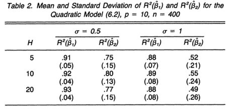
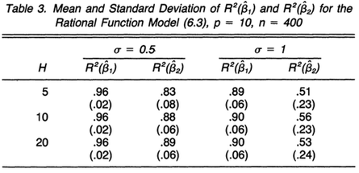

---
notice: | 
  @ref5
...

# Introduction

## Introduction

### Regression Analysis
- Study the relationship of a response variable y and its explanatory variable x
- Use the information of x to explain y 
- Parametric model  
    + Linear Regression model 
- Nonparametric model  
    + Local smoothing (kNN)  

### Curse of Dimensionality
- When the dimension of x gets higher, observations are far away from each other
- Standard methods probably will break down due to the sparseness of data
- We need to reduce the dimension of x so that it's easier for visualizing data and fitting models  

# A Model for dimension reduction

## A Model for dimension reduction

### A Model for dimension reduction 
\begin{block}{Model Settings}
\[
  y = f(\beta_1x, \dots, \beta_kx, \epsilon)
\]
$x$ is explanatory variable, column vectors on $\mathcal{R}^p$,\\   
$\beta's$ are unknown row vectors, \\
$\epsilon$ is independent of $x$, \\
$f$ is an arbitrary unknown function on $\mathcal{R}^{p+1}$ \\
\end{block}
- $(\beta_1x, \dots, \beta_kx)'$ is the projection of the $x\in \mathcal{R}^p$ into $\mathcal{R}^K$, $K<p$  
- Captures all we need to know about y  

### A Model for dimension reduction

\begin{block}{Effective dimension-reduction}
\begin{enumerate}
  \item Effective dimension-reduction directions (e.d.r)
    \begin{itemize}
      \item Any Linear combination of $\beta's$
    \end{itemize}
  \item A Linear space  $\mathcal{B}$:
    \begin{itemize}
     \item Spanned by $\beta's$ $\Leftrightarrow~Span(\beta)~$
    \end{itemize}
\end{enumerate}
\end{block}

- Since $f$ is arbitrary, only the $\mathcal{B}$ can be identified  
- Inverse Regression one of the methods of estimating the Effective dimension-reduction directions


# Inverse Regression 

## Inverse Regression

### Inverse Regression

#### Inverse Regression
- Regress x against of y
- Use the information of y to explain x 
- From one p-dimension problem to p One-dimension regression problems

### Inverse Regression Curve


\begin{block}{Inverse Regression Curve}
\[E(x|y) \in \mathcal{R}^p\]
\end{block}

#### Centered Inverse Regression Curve
\[ E(x|y) - E(x)\]

- $E[E(x|y)] = E(x)$ is the center  
- With certain conditions, the centered inverse curve is related with the e.d.r.!  

### Conditions

#### Condition 1.1

Conditional Independence
\[
  y = f(\beta_1x, \dots, \beta_kx, \epsilon) \Leftrightarrow y|\beta x       \Perp x  
\]

#### Condition 3.1 

For any $b$ in $\mathcal{R}^p$, 
\[E(b\boldsymbol{x}|\beta_1\boldsymbol{x} = \beta_1x, \dots, \beta_k\boldsymbol{x} = \beta_kx) = c_0 + c_1\beta_1x, \dots, c_k\beta_kx\]


### Centered Inverse Regression Curve and e.d.r

\begin{block}{Theorem 3.1} 
Under the previous Conditions,
\[ E(x|y) - E(x) \subset Span(\beta_k\Sigma_{xx}),k = 1, \dots, K\]
The centered inverse regression curve is contained in the linear subsapce spanned by $\beta_k\Sigma_{xx}$
\end{block}

### Centered Inverse Regression Curve and e.d.r
\begin{block}{Corollary 3.1} 
\[ z = \Sigma_{xx}^{-1/2}[x-E(x)] \]
x is the standardized 

\[ f(\beta_1x, \dots, \beta_kx, \epsilon) \Rightarrow f(\eta_1z, \dots, \eta_kz, \epsilon) \Rightarrow \beta_k = \eta_k \Sigma_{xx}^{-1/2}\]

\[E(z|y) - E(z) \subset Span(\eta_k), k=1 ,\dots, K\]
\end{block}

### An Important consequence 

#### Covariance matrix is the key
- The Covariance matrix $Cov(E(z|y))$ is degenerated in any direction which is orthogonal to $\eta's$
- ${\eta_k}'s ~ ( k =1, \dots, K)$ associated with largest K eigenvalues of  $Cov(E(z|y))$

#### How to estimate the $Cov(E(z|y))$
That leads to Sliced Inverse Regression Method

# Sliced Inverse Regression Method

## Sliced Inverse Regression Method

### Sliced Inverse Regression Method

1. Standardize x 
    + $z_i = \Sigma_{xx}^{-1/2}(x_i - \bar{x})(i = 1, \dots, n)$

2. Divide the range of y into H slices, $I_1, \dots , I_H$
    + $\hat{p}_h = (1/n)\sum_{i=1}^n(I_{y_i\in I_h})$

3. Calculate the sample mean for each slice
    + $\hat{m}_h = (1/n\hat{p}_h) \sum_{y_i \in I_h}z_i$ 

4. Conduct a Principal Component Analysis on the estimated Covariance matrix
    + $\hat{V} = \sum_{h=1}^{H} \hat{p}_h\hat{m}_h\hat{m}_h'$

5. Select the K largest eigenvectors (row vectors) 
    + $\hat{\eta}_k (k = 1, ... , K)$

6. Transform the eigenvectors back to original scale 
    + $\hat{\beta}_k = \hat{\eta}_k \hat{\Sigma}_{xx}^{-1/2}$


# Simulation 

## Simulation 

### Simulation 1
\begin{exampleblock}{Simulation settings}
\begin{align*}
y &= x_1 + x_2 + x_3 + x_4 + 0x_5 + \epsilon 
\end{align*}
\begin{itemize}
    \item $n = 100$
    \item Only one component $\beta = (1,1,1,1,0)$
    \item Normalized target $\beta^* = (0.5, 0.5, 0.5, 0.5, 0)$
    \item The number of slice $H = (5, 10, 20)$
\end{itemize}
\end{exampleblock}


### Simulation 1 results

```{r, echo=FALSE}
knitr::include_graphics("./pic/result_1.png") 
```

- Repeat the simulation 100 times to generate the empirical distribution of ${\hat{\beta}}'s$  

- Since we want to compare two directions, $\beta$ and $\hat{\beta}$ are standardized 


### Simulation 2
\begin{exampleblock}{Simulation settings}
\begin{align*}
y &= x_1(x_1 + x_2 + 1) + \sigma \cdot \epsilon \\
y &= \frac{x_1}{0.5 + {(x_2 + 1.5)}^2} + \sigma \cdot \epsilon
\end{align*}
\begin{itemize}
    \item $n = 400$
    \item $\sigma = (0.5, ~1) $
    \item The number of slice $H = (5, 10, 20)$ 
    \item Two component $\beta_1 = (1,0,0,0,0), ~ \beta_2 = (0,1,0,0,0)$
\end{itemize}
\end{exampleblock}


### Evaluate the effectiveness of estimated e.d.r direction

#### Criterion of one direction
\[
R^2(\hat{b}) = \max_{\beta\in \mathcal{B}}\frac{(\hat{b}\Sigma_{xx}\beta')^2}{\hat{b}\Sigma_{xx}\hat{b}' \cdot \beta\Sigma_{xx}\beta'}
\]
Squared correlation coefficient between the bx and $\beta_1x, \dots , \beta_kx$
Invariant under affine transformation of x

#### Criterion of the subspace $B$
\[
R^2(\hat{\mathcal{B}}) = \frac{\sum_{k=1}^{K}R^2(\hat{b}_k)}{K}
\]

### Simulation 2 results

```{r, echo=FALSE}

```

- Repeat the simulation 100 times to generate the empirical distribution of $\beta's$

### Simulation 3 results

```{r, echo=FALSE}

```

- Repeat the simulation 100 times to generate the empirical distribution of $\beta's$


###
\begin{center}
\Huge Thank you
\end{center}

### Reference


