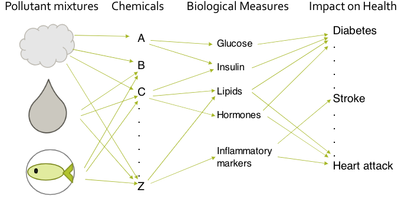
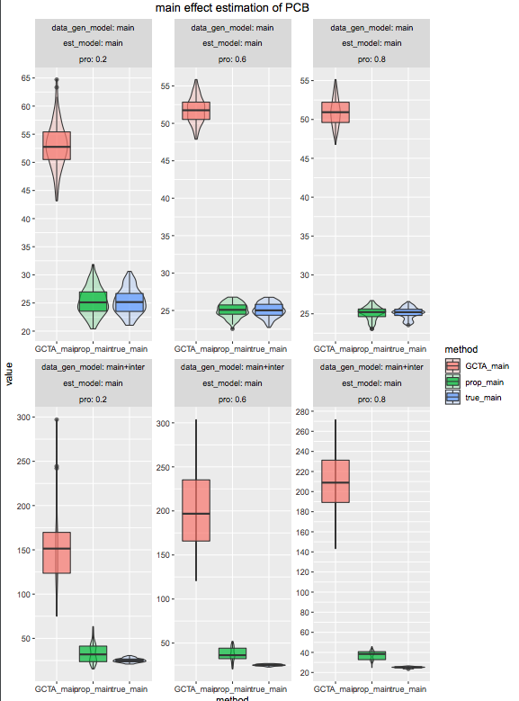

# Background

### Background 

To understand the effects of the environment (chemical mixtures) on human health.

{width=50%}

### Challenge

- lack of traditional epidemiology methodology, e.g. the pathway is not clear
- Many weak signals, hard to identify and select, e.g lasso type is not working

{width=70%}

### Environmental Data

#### Data

* Covariates are concentration of environmental mixtures, e.g. heavy metal, PCBs 
    + Continuous 
    + The number of predictors are around 30 to 100
    + There are high correlations among those covariates
    + Magnitude levels are very low
* Response are health outcomes, e.g. blood pressure, disease status,etc.

# Goal 

### Goal

- Evaluate the relation between the environmental mixture and health outcomes
- More specifically, the variance $Var(X^T\beta)$

# Solution: GCTA method

### What is the GCTA method

- GCTA: Genome-wide complex trait analysis
- GCTA estimates the variance of y related to the covariates.

#### a working linear mixed effects model
\begin{align}
Y_i &= \mu + \sum_{j = 1}^pX_{ij}\beta_j+ \epsilon_i \\
Y_i &= \mu + \sum_{j = 1}^p X_{ij}\beta_j + \sum_{0 \leq l < k \leq p} \gamma_{lk}X_{il}X_{ik} + \epsilon_i  
\end{align}

### Limitations 

#### Assumption
Covariates have to be independent to each other

#### Real world
Each covariates are more likely to be correlated to each other

### Decorrelation
The linear transformation is 
\[
     \Tilde{\*X}= A^{-1}\*X,
\]
where $\*X$ are the covariates vector,$A$ is a linear transformation operator which is a full rank square matrix.
After transformation, the covariance of the new covariates $\Tilde{\*X}$ will be 
\[
    Var(\Tilde{\*X}) = I_p.
\]
Moreover, based on the model from last slide, we have 
\[
   \*Y = \mu + \*X^T\beta + \*\epsilon = \Tilde{\*X}^TA^T\beta + \*\epsilon = \Tilde{\*X}^T\alpha + \*\epsilon,
\]
where $\alpha = A^T\beta$.
Let's look the total effect of $\*X$ and $\*Z$:
\[
    Var(\*X^T\beta) = Var(\Tilde{\*X}^TA^T\beta) = Var(\Tilde{\*X}^T\alpha).
\]

# Result

### Simulation result
{width=120%}

# Stardardized covaraites: unexpected problem

### Why X is standardized

- The benefit we get from standardizing data is computational efficiency. 
- The the columns of standardized data are in the same scale, so there is no too large or too small values, which may cause computational issues, i.e. rounding.

### What is changed if use standardized

\[
Z_k = \frac{X_k-\mu_k}{\sigma_k} \implies X_k = \sigma_k Z_k + \mu_k
\]

\begin{align*}
Y &= \mu + \sum_{k = 1}^p (\sigma_k Z_k + \mu_k)\beta_k + \epsilon\\
  &= \mu + \sum_{k = 1}^p(\mu_k+\beta_k) + \sum_{k = 1}^p(Z_k \sigma_k \beta_k) + \epsilon.
\end{align*}
By the property of variance, we have 
\[
Var(\sum_{k = 1}^pX_{k}\beta_k) = Var(\sum_{k = 1}^pZ_k \sigma_k \beta_k).
\]

### same for the interaction? 

\begin{align*}
\sum_{0 \leq l < k \leq p} \gamma_{lk}X_{l}X_{k} &= \sum_{0 \leq l < k \leq p} \gamma_{lk}(\sigma_l Z_l + \mu_l)(\sigma_k Z_k + \mu_k)\\
                             &= \sum_{0 \leq l < k \leq p}(\gamma_{lk}\sigma_l\sigma_kZ_lZ_k) +  \sum_{0 \leq l < k \leq p}(\gamma_{lk}\sigma_l Z_l \mu_k)\\
                             &\phantom{{}=1} + \sum_{0 \leq l < k \leq p}(\gamma_{lk}\sigma_k Z_k \mu_l) + \mu^*.
\end{align*}

- $Var(\sum_{k = 1}^p(Z_k \beta^*_k)) \neq Var(\sum_{k = 1}^p(X_k \beta_k))$
- $Var(\sum_{0 \leq l < k \leq p}(\gamma^*_{lk}Z_lZ_k)) \neq Var(\sum_{0 \leq l < k \leq p} \gamma_{lk}X_{l}X_{k})$

### Solution

#### Total effect
\begin{align*}
Var\left(\sum_{j = 1}^p X_{j}\beta_j + \sum_{0 \leq l < k \leq p} \gamma_{lk}X_{l}X_{k} \right) = \\ Var\left(\sum_{k = 1}^p(Z_k \beta^*_k) + \sum_{0 \leq l < k \leq p}(\gamma^*_{lk}Z_lZ_k) \right)
\end{align*}

### Future work

- Separate the main and interaction effects 
- Statistical test on the interaction effects
