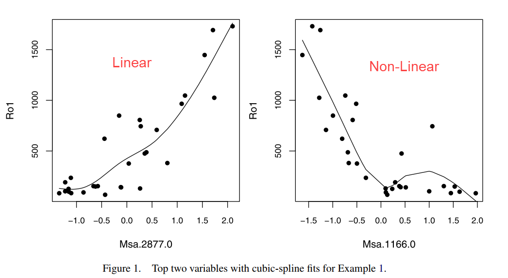
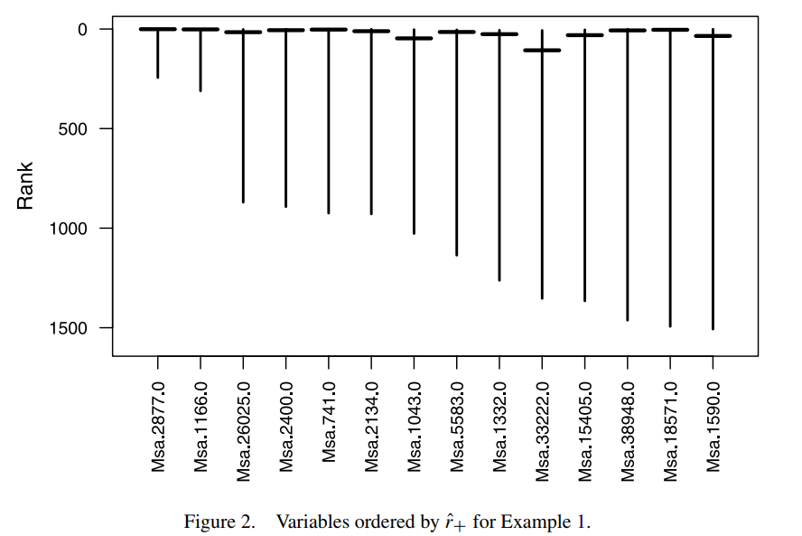
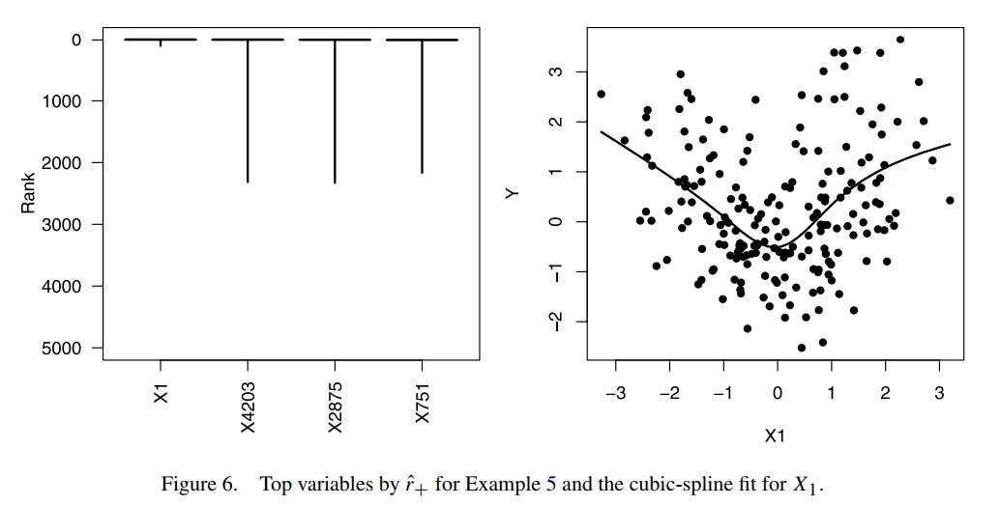

---
notice: | 
  @ref6
...

# Variable Selection Problem

### Model settings and Assumptions

\begin{block}{Model setup for variable selection}

\[
  Y_i = \alpha + \beta_1X_{i1} + \dots + \beta_{p}X_{ip} + error
\]

\end{block}

- We assume the model is linear between X and Y 
- Variable selection is achieved by shrinking many $\beta's$ to zeros
- LASSO is one of the popular and effective approaches

### What if it's not Linear between X and Y
- A key assumption of variable selection method (LASSO) is Linearity
- If the model is non-linear, some of the predictors may not be detected by a linear model-based variable selection method

### Motivating Example

{width=70%}

- Micoroarray data of heart disease  
- Ro1: expression level, continuous response  
- Msa: different genes, continuous predictor  

### The Collinearity
- Even the model is perfectly linear, fitting a linear model may conceal importance components of X just because of the collinearity 
- It's also called the "masking effect", which means we only can select part of the important variables 
- However, at point of variable selection, we want to be able to select all of them
- Back to the previous heat disease example, $cor(Msa.2877, Msa.1166) = -0.71$. So it's possible that the collinearity prevents us to find the Msa.1166

# Solution: Generalized Correlation 

### Generalized Correlation

\begin{block}{Generalized Correlation coefficient between $X_{ij}$ and $Y_i$}

\[
  \sup\limits_{h \in \mathcal{H}} \frac{cov\{h(X_{ij}), Y_i\}}{\sqrt{var\{h(X_{ij})\} \cdot var(Y_i)}}
\]
Estimated by,
\[
\sup\limits_{h \in \mathcal{H}} \frac{\sum_i\{h(X_{ij}) - \bar{h}\}(Y_i - \bar{Y})}{\sqrt{\sum_i {\{h(X_{ij})-\bar{h}\}}^2 \cdot \sum_i {(Y_i - \bar{Y})}^2}}
\]
\end{block}

- $(X_1, Y_1), \dots, (X_n, Y_n)$ are iid
- X is p-vectors 
- Y is scalars
- $\mathcal{H}$ is a vector space of functions
- $\bar{h} = n^{-1}\sum_ih(X_{ij})$

### Simplify the computation 

\begin{block}{Removing $Var(Y_i)$}
    \begin{align*} 
      \psi_j &= \sup\limits_{h \in \mathcal{H}} \frac{cov\{h(X_{ij}), Y_i\}}{\sqrt{var\{h(X_{ij})\}}} \\   
      \hat{\psi}_j &= \sup\limits_{h \in \mathcal{H}} \frac{\sum_i\{h(X_{ij}) - \bar{h}\}(Y_i - \bar{Y})}{\sqrt{n\sum_i \{h(X_{ij})-\bar{h}\}^2}}
    \end{align*} 
\end{block}

- Since  $Var(Y_i)$ is same for each i, we can remove it without affecting the ranking of the correlation

### Simplify the computation Cont.
\begin{block}{Theorem 1}
Assume $\mathcal{H}$ is a finite-dimensional function space include the constant function, and there exists $ h\in\mathcal{H}$ that achieves $\hat{\psi}_j$,

\[
\argmin{h \in \mathcal{H}} \sum^n\limits_{i = 1}\{Y_i - h(X_{ij})\}^2 \subseteq \argmax{h \in \mathcal{H}} \hat{\psi}_j
\]
The maximizer of $\hat{\psi}_j$ is the solution to least squares problem in $\mathcal{H}$
\end{block}

\begin{block}{Reduction of $\hat{\psi}_j$ in the size of squared error}
\[
  \hat{\varphi}_j = \sum^n\limits_{i = 1} (Y_i - \bar{Y})^2 - \inf\limits_{h \in \mathcal{H}}\sum^n\limits_{i = 1}\{Y_i - h(X_{ij})\}^2
\]
Since $\hat{\varphi}_j$ keeps the relative relation of $\hat{\psi}_j$, we can use $\hat{\varphi}_j$'s for ranking
\end{block}

### Correlation Ranking

#### Some notations

- We order estimator $\hat{\psi}_j$ as $\hat{\psi}_{\hat{j}_1} \geq \dots \geq  \hat{\psi}_{\hat{j}_p}$
\[
  \hat{j}_1 \succeq \dots \succeq \hat{j}_p
\]

- $j \succeq j'$ means $\hat{\psi}_j \geq \hat{\psi}_{j'}$, we could say jth coefficient of X is at least as much importance as the j'th coefficient

- $r = \hat{r}(j)$ means the rank of the jth coefficient is r, in other words  $\hat{j}_r = j$

### Estimation of the rank
We could use Bootstrap to assess the empirical rank for each component of X  
A $(1-\alpha)$ level, two-side interval is defined as following:

\begin{block}{Interval of rank $[\hat{r}_{-}(j), \hat{r}_{+}(j)]$}
\[
  P\{r^*(j)\leq \hat{r}_{-}(j)|\mathcal{D}\} \approx P\{r^*(j)\geq \hat{r}_{+}(j)|\mathcal{D}\} \approx \frac{\alpha}{2}
\]
\end{block}

- $r^*(j)$ the bootstrap version estimators of $r(j)$
- The approximation is used because of the discreteness of ranks 
- Small value of $r^*(j)$ indicates large influence on Y
- In order to select variables, we could sort $r^*(j)$ or $\hat{r}_{+}(j)$ and set a cut off value $p$

# Simulation study

### heart disease data
{width=70%}

- $n =30$, $p = 6319$
- Number of bootstrap runs is 400
- $\alpha = 0.02$ cutoff value is $p/4$
- ranking is based on $\hat{r}_{+}(j)$
- Note: There is a marked jump in the length of the predict intervals

### Simulation study on non-linear model

\begin{block}{simulation setup} 
\[
  Y_i = W^2_i -1 + \epsilon_i
\]
\end{block}
- $W_i \sim Unif[-2,2]$
- $X_{i1} = W_{i} + \delta_i$ (errors-in-variables type)
- $X_{i2}, \dots, X_{i5000} \stackrel{iid}{\sim} N(0,1)$ 
- $\delta, \epsilon \stackrel{iid}{\sim} N(0, 3/4)$
- $n = 200, ~ \alpha = 0.02, n_{bootstrap} = 500$

### Simulation study on non-linear model Cont.
{width=70%}

- the cutoff value is $p/2$  
- Conventional correlation fails to select $X_{i1}$ as influential variable  
- Generalized correlation method is able to select the $X_{i1}$ with only 3 false positive variables   

# Conclusion

### Potential applications

- It can be used as a "massive dimension reduction" method
- It should be a more effective variable selection method for (Generalized) Additive Model

### Further topics
- Unbiasedness and Consistency of the selected Variables  
- The choice of cutoff value 

### 
\begin{center}
\Huge Thank you
\end{center}

### Reference

