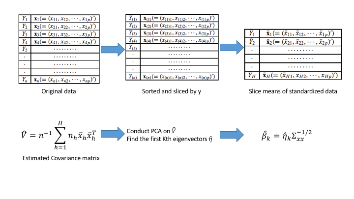

# Background and Challenges
### Sufficient Dimension Reduction 
\begin{block}{Model Settings}
\[
  Y = f(X,\epsilon) = f(\beta_1X, \dots, \beta_kX, \epsilon)
\]
$x$ is explanatory variable, column vectors on $\mathcal{R}^p$,\\   
$\beta's$ are unknown row vectors, \\
$\epsilon$ is independent of $X$, \\
$f$ is an \textcolor{red}{arbitrary unknown} function on $\mathcal{R}^{k+1}$ \\
\end{block}
- $(\beta_1X, \dots, \beta_kX)'$ is the projection of the $X\in \mathcal{R}^p$ into $\mathcal{R}^K$, $K<<p$
- \textcolor{red}{Lower dimension projection of X contains most of the information}

### Sufficient Dimension Reduction 

\begin{block}{The space spaned by $\beta's$}
\begin{enumerate}
  \item Effective dimension-reduction direction (e.d.r)
    \begin{itemize}
      \item A Linear combination of $\beta's$
    \end{itemize}
  \item A Linear space  $\mathcal{B}$:
    \begin{itemize}
     \item Spanned by $\beta's$ $(Span(\beta))~\Leftrightarrow~$ All the possible linear combination of $\beta's$
    \end{itemize}
\end{enumerate}
\end{block}

- Since $f$ is arbitrary, $f$ and $\beta's$ are not Estimable
- Only the $\mathcal{B}$ can be identified  
- Inverse Regression is one of the methods of estimating the Effective dimension-reduction space ($\mathcal{B}$)

### Sliced Inverse Regression method
{width=500px}

### Binary response 

\begin{block} {The curse of Binary response for the sliced-based methods}
Since the responses only have to values, the number slices
\end{block}

- For the method using only first moment, only one direction can be recovered
- For the method using more than moment(SAVE), there are situations they cannot recover all the directions

### Existing apporaches
- Using SVM to estimate the sudo conditional probability 

# A novel approach: Representative
### Representative approach

# Simulation results

### Data generating models for binary response
Let $Y^*$ as the latent response and Y as the observed binary response,
\[
    Y=\left\{
                \begin{array}{ll}
                  0 ~~~Y^* < \theta \\
                  1 ~~~Y^* \ge \theta \\
                \end{array}
      \right.
\]
Where $\theta$ is the cutoff value.
\[
    Y^* = f(X^T\beta_1, \dots, X^T\beta_p, \epsilon),
\]
Where $\epsilon$ is a random variable.
Thus, we have 
\[
    \mathcal{P}(Y = 1|X) = Pr(Y^* > \theta|X).
\]
Note that different distribution $\epsilon$ will eventually affect the distribution of Y.

### Data generating models

#### Conditional probability model
\begin{align*}
  \lambda(\mathcal{P}(Y = 1|X)) &= h(\beta_1^TX, \dots, \beta_pX) \\
          \mathcal{P}(Y = 1|X)  &= \lambda^{-1} \circ h(\beta_1^TX, \dots, \beta_pX) \\
                        &= g(\beta_1^TX, \dots, \beta_pX)
\end{align*}

### Troubles for traditional methods

### Simulation results
{width=500px}

### Simulation results
{width=500px}

# Aysmptotic property 

### The conditional expecation and representative 
### The choice of number of cluster K