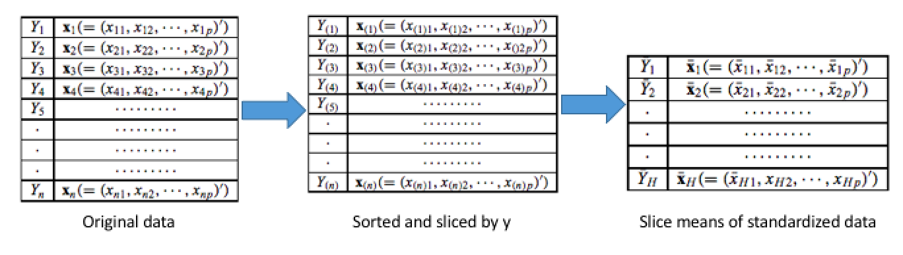

---
notice: | 
  @ref6
  @ref7
  @ref8
  @ref9
...

```{r,include=F, warning=F}
library(kableExtra)
library(tidyverse)
library(gridExtra)
library(data.table)
library(ggpubr)
theme_set(theme_gray(base_size = 22))
source("~/dev/dr_sim_code/Binary_response/Reports/representative_binary_response/make_table_JSM_slides.R")
```

# Background
### Sufficient dimension reduction
#### Fundamental assumption
Let random vector $X \in \mathbb{R}^{p \times 1}$, $Y \in \mathbb{R}$, $B = (b_1, \dots,b_d) \in \mathbb{R}^{p\times d}$, where $d << p$ and $A \in \mathbb{R}^{d\times d}$ is a non-singular matrix. 
\[
Y|X \stackrel{d}{=} Y|B^T X
\]

\[
  Y \indep X|B^TX \Rightarrow Y \indep X|(BA)^TX, 
\]
So $B$ is not identifiable, but $span(B)$ is identifiable.

### Sufficient dimension reduction

#### Dimension-reduction subspace (DRS)
\[
  Y \indep X|P_SX,~~ P_\mathcal{S} = B(B^TB)^{-1}B^T
\]
$\mathcal{S}$ is called the dimension-reduction subspace.

However,$\mathcal{S}$ is not unique. Actually if $\mathcal{S} \subset \mathcal{S}_1$, then $\mathcal{S}_1$ is also a dimension-reduction space.  


#### Target: Central Subspace
\[
S_{Y|X} = \cap S_{DRS}
\]
Under mild conditions, $S_{Y|X}$ is unique and a DRS subspace itself (Cook, 1996). 

### Estimating the central subspace

\begin{block}{Inverse regression: Condition X on Y} 
To Estimate a linear subspace $\Rightarrow$ a Basis $B$ of $S_{Y|X}$ \\
Sliced Inverse Regression (SIR) (Li 1991)    
\begin{center}
$E(X|Y) - E(X) \in \Sigma_XS_{Y|X} \Rightarrow \hat{B} = (\hat{b}_1, \dots, \hat{b}_d)$   
\end{center}

Sliced Average Variance Estimation (SAVE) (Cook et al. 1991)     
\begin{center}
$span(\Sigma_x - \Sigma_{X|\tilde{Y}}) \subseteq S_{Y|X} \Rightarrow \hat{B} = (\hat{b}_1, \dots, \hat{b}_d)$
\end{center}

\end{block}


### Slicing method

{width=400px}  

1. Sort the data based on the response values.  
1. Split data into the slices based on the sorted responses. 

### Binary response

Binary response only has two levels, e.g. $0,1$.

#### Limited number of slices
- Only two slices are available   
  - For SIR, it can only find one direction at most  
  - For SAVE, it also suffers from the limit number of slices

# Existing solution

### Probability Enhanced (PRE) method (Shin et al. 2014)

#### Main idea
- $S_{Y|X} = S_{P(X)}$, $P(x) = \mathcal{P}(Y = 1|X = x)$ is the conditional probability
- $Y \Rightarrow P(X) \in [0,1]$
- Weighted Support Vector Machine(WSVM) to estimate the $\hat{P}(X)$

#### Computational time
- SVM method is sensitive to the number of observation N

# Our approach

### Representative approach 
#### Representative 
A Representative is a summary statistic of data points within a cluster:
For $(X_i, Y_i), i \in I_k$ and $n_k$ is sample size of $I_k$ 
\[
  X^*_k = R(X_{1}, \dots, X_{n_k}) = \frac{\sum_i X_i}{n_k},~~ Y^*_k = R(Y_{1}, \dots, Y_{n_k}) = \frac{\sum_i Y_i}{n_k},
\]
where $R$ is the summarizing function.

#### Steps
1. Cluster $(X_1, \dots,X_N)$ into K groups $I_1, \dots, I_K$, e.g.K-means 
1. Calculate the representatives for each cluster $I_k$
1. Apply dimension reduction methods on the K representatives


### Additional value: Big data solution (N is large)


#### Clustering step
Clustering step reduced the sample size from $N$ to $K$.   

- $(Y_1,X_1) \dots (Y_N,X_N) \to (Y^*_{1},X^*_{1}) \dots (Y^*_K,X^*_K)$   

- Note if the data set is too large, we could also use the online clustering method.  

### Additional value: Big data solution (N is large)

#### Parallel Algorithm for SIR and SAVE 
1. Split the sliced data into b blocks, $X_1, \dots X_B$    
1. Load each block $X_b$ and calculate the statistics for each block such as $\bar{X}_b, \bar{X}_{hb}, n_{hb}, X^T_{hb}X_{hb}$  
1. Summary the statistics across the blocks and slices to get the candidate matrix $M_{SIR}, M_{SAVE}$  

# Simulation result 

### Simulation setup 

#### Data generation model: Latent model
\[
    Y=\left\{
                \begin{array}{ll}
                  0 ~~~f(b_1^TX,b_2^TX, b_3^TX, \epsilon) < 0 \\
                  1 ~~~\text{Otherwise} \\
                \end{array}
      \right. 
\]
where 

- $X \in \mathbb{R}^6 \sim N(\mathbf 0, \mathbf I)$  
- $b_i = e_i = (0,\dots, 1,0,\dots,0)^T$, so $b_1^TX = X_1, b_2^TX = X_2, b_3^TX = X_3$
- $\epsilon \sim N(0,1)$

### Simulation result

#### Performance evaluation
1. The number of directions of the central space: Hypothesis Test  
1. Difference between a true bias B and an estimated $\hat{B}$:   
    * Trace correlation and Frobenius distance

#### Result summary
- The true basis is $(e_1,e_2, e_3)$.  
- The proposed method is able to recover the whole true central space.
- Other methods can only find part of the central space.


### Simulation result of SAVE
```{r, echo=FALSE,eval=F}
kable(rbind(save_final), "latex", booktabs = T) %>%
kable_styling(latex_options = "scale_down") %>%
add_header_above(c(" ", "Log_n" = 8)) %>%
add_header_above(c(" ", "SAVE_original" = 4, 
                        "SAVE_R" = 4))
```

\begin{table}[]
\centering
\caption{Simulation result of SAVE}
\resizebox{\textwidth}{!}{%
\begin{tabular}{|c|c|cccc|cccc|}
\hline
\multicolumn{2}{|c|}{\multirow{2}{*}{}}              & \multicolumn{4}{c|}{Original SAVE} & \multicolumn{4}{c|}{Proposed SAVE}                \\ \cline{3-10} 
\multicolumn{2}{|c|}{}                               & \multicolumn{8}{c|}{log n}                                                      \\ \hline
                          & $H_0$ vs $H_1$       & 3      & 4      & 5      & 6      & 3    & 4    & 5             & 6             \\ \hline
\multirow{3}{*}{Power}    & 0D vs \textgreater{}= 1D & 0.9    & 1      & 1      & 1      & 0    & 0.05 & \color{blue}\textbf{1}    & \color{blue}\textbf{1}    \\
                          & 1D vs \textgreater{}= 2D & 0.08   & 0.52   & 0.52   & 0.5    & 0    & 0    & \color{blue}\textbf{1}    & \color{blue}\textbf{1}    \\
                          & 2D vs \textgreater{}= 3D & 0      & 0.05   & 0.06   & 0.06   & 0    & 0    & 0.05          & \color{blue}\textbf{1}    \\ \hline
\multirow{3}{*}{Type-I}   & 3D vs \textgreater{}= 4D & 0      & 0      & 0      & 0.01   & 0    & 0    & 0             & 0.01          \\
                          & 4D vs \textgreater{}= 5D & 0      & 0      & 0      & 0      & 0    & 0    & 0             & 0             \\
                          & 5D vs \textgreater{}= 6D & 0      & 0      & 0      & 0      & 0    & 0    & 0             & 0             \\ \hline
\multirow{2}{*}{Distance} & F                        & 1.33   & 1.2    & 1.21   & 1.19   & 1.71 & 1.03 & \color{blue}\textbf{0.23} & \color{blue}\textbf{0.07} \\
                          & R                        & 0.17   & 0.14   & 0.14   & 0.13   & 0.29 & 0.1  & \color{blue}\textbf{0.01} & \color{blue}\textbf{0}    \\ \hline
\end{tabular}%
}
\end{table}

# Conclusion

### Conclusion and Future work

#### Conclusion 
- Better recover the central space in binary responses
- Greatly shorten the running time in big data

#### Future work
- Investigate optimal the choice of k to achieve the best performance of SDR methods.

### Reference 


<!-- ### Backup -->

<!-- \begin{examples} -->

<!-- 1. Linear regression: $Y = a + b_1^TX + b_2^TX + \epsilon$ -->

<!-- 2. NonLinear regression: $Y = a + \exp(b_1^TX) + \sin(b_2^TX) + \epsilon$ -->

<!-- 3. More general: $Y = f(b_1^TX, b_2^TX, \epsilon)$ -->
<!-- \end{examples} -->

<!-- ### Simulation result of SIR -->

<!-- ```{r, echo=FALSE,eval=F} -->
<!-- kable(sir_final, "latex", booktabs = T) %>% -->
<!-- kable_styling(latex_options = "scale_down") %>% -->
<!-- add_header_above(c(" ", "Log_n" = 12)) %>% -->
<!-- add_header_above(c(" ", "SIR_original" = 4,  -->
<!--                         "SIR_PRE" = 4, -->
<!--                         "SIR_R" = 4)) -->
<!-- ``` -->


<!-- \begin{table}[] -->
<!-- \centering -->
<!-- \caption{Simulation result of SIR} -->
<!-- \resizebox{\textwidth}{!}{% -->
<!-- \begin{tabular}{|c|c|cccc|cccc|cccc|} -->
<!-- \hline -->
<!-- \multicolumn{2}{|l|}{\multirow{2}{*}{}}              & \multicolumn{4}{c|}{SIR\_Binary} & \multicolumn{4}{c|}{SIR\_PRE} & \multicolumn{4}{c|}{SIR\_R}                 \\ \cline{3-14}  -->
<!-- \multicolumn{2}{|l|}{}                               & \multicolumn{12}{c|}{log n}                                                                                    \\ \hline -->
<!-- \multicolumn{1}{|l|}{}    & Direction/Distance       & 3      & 4      & 5      & 6     & 3        & 4    & 5    & 6    & 3    & 4          & 5          & 6          \\ -->
<!-- \multirow{3}{*}{Power}    & 0D vs \textgreater{}= 1D & 1      & 1      & 1      & 1     & 1        & .    & .    & .    & 0.75 & \textbf{1} & \textbf{1} & \textbf{1} \\ -->
<!--                           & 1D vs \textgreater{}= 2D & .      & .      & .      & .     & 1        & .    & .    & .    & 0.16 & \textbf{1} & \textbf{1} & \textbf{1} \\ -->
<!--                           & 2D vs \textgreater{}= 3D & .      & .      & .      & .     & 0.96     & .    & .    & .    & 0.01 & 0.01       & 0          & 0.01       \\ \hline -->
<!-- \multirow{3}{*}{Type-I}   & 3D vs \textgreater{}= 4D & .      & .      & .      & .     & 0.5      & .    & .    & .    & 0    & 0          & 0          & 0          \\ -->
<!--                           & 4D vs \textgreater{}= 5D & .      & .      & .      & .     & 0.1      & .    & .    & .    & 0    & 0          & 0          & 0          \\ -->
<!--                           & 5D vs \textgreater{}= 6D & .      & .      & .      & .     & 0.01     & .    & .    & .    & 0    & 0          & 0          & 0          \\ \hline -->
<!-- \multirow{2}{*}{Distance} & F                        & 1.13   & 1.05   & 1.06   & 1.09  & 1.14     & .    & .    & .    & 1.37 & 1.29       & 1.24       & 1.29       \\ -->
<!--                           & R                        & 0.14   & 0.14   & 0.14   & 0.15  & 0.12     & .    & .    & .    & 0.18 & 0.15       & 0.15       & 0.15       \\ \hline -->
<!-- \end{tabular}% -->
<!-- } -->
<!-- \end{table} -->
<!-- Iteration time is 200 and significant level is 0.05 -->


<!-- #### Performance evaluation -->
<!-- 1. The number of directions of the central space: Hypothesis Test   -->
<!-- 1. Difference between a true bias B and an estimated $\hat{B}$:    -->
<!--     * Trace correlation: $R = 1 - \frac{1}{k}\sum_{i = 1}^k \rho_i^2$, where $\rho^2_i$ is the i-th eigenvalue of $\hat{B}^TBB^T\hat{B}$.   -->
<!--     * Frobenius distance: $F = \Vert P_B - P_{\hat{B}}\Vert_F$.  -->
<!--     where $P_A = A(A^TA)^{-1}A$ and $\Vert A\Vert_F = \sqrt{\sum_i\sum_j a^2_{ij}}$.  -->


<!-- ### Simulation setup  -->

<!-- #### Data generation model: Latent model -->
<!-- \[ -->
<!--     Y=\left\{ -->
<!--                 \begin{array}{ll} -->
<!--                   0 ~~~(b_1^TX)^2*e^{(b_2^TX)}*\sin(b_3^TX) + \epsilon < 0 \\ -->
<!--                   1 ~~~\text{Otherwise} \\ -->
<!--                 \end{array} -->
<!--       \right.  -->
<!-- \] -->
<!-- where  -->

<!-- - $X \in \mathbb{R}^6 \sim N(\mathbf 0, \mathbf I)$   -->
<!-- - $b_i = e_i = (0,\dots, 1,0,\dots,0)^T$, so $b_1^TX = X_1, b_2^TX = X_2, b_3^TX = X_3$ -->
<!-- - $\epsilon \sim N(0,1)$ -->
<!-- - $P(X) = \Phi((b_1^TX)^2*e^{(b_2^TX)}*\sin(b_3^TX))$, where $\Phi$ is the CDF of standard normal distribution. -->

<!-- ### How it works -->
<!-- #### Main idea -->
<!-- Y and $P(X)$ have identical central space: $S_{Y|X} = S_{P(X)|X}$  -->

<!-- \begin{center} -->
<!-- $Y = f(b_1^TX, \dots, b_d^TX)$ -->
<!-- $\Rightarrow$ -->
<!-- $\mathcal{P}(Y = 1 |X) = P(X) = P(b_1^TX, \dots, b_d^TX)$ -->
<!-- \end{center} -->

<!-- #### For the Representative -->
<!-- \begin{center} -->
<!-- $Y^*_k = \hat{\mathcal{P}}(Y = 1|X_i, i\in I_k) \approx P(b_1^T\bar{X}_k, \dots, b_d^T\bar{X}_k)$ -->
<!-- $Y^*_k \rightarrow P(Y=1|X=x_k) \text{ as } N,K,N/K \to \infty$ -->
<!-- \end{center} -->
