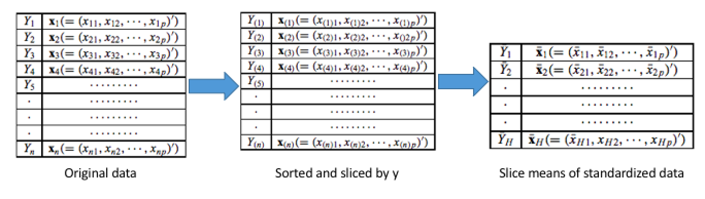

---
notice: | 
  @ref6
  @ref7
  @ref8
  @ref9
...

```{r,include=F, warning=F}
library(kableExtra)
library(tidyverse)
library(gridExtra)
library(data.table)
library(ggpubr)
theme_set(theme_gray(base_size = 22))
source("~/dev/dr_sim_code/Binary_response/Reports/representative_binary_response/make_table_JSM_slides.R")
source("~/dev/dr_sim_code/Binary_response/Reports/representative_binary_response/make_plot_dr_WDBC.R")
```

# Motivation

## Motivation 

### Motivation of dimension reduction

#### Issues of high dimensional data (p is large)  
- Curse of dimensionality (e.g. data points become sparse)  
- Model overfitting 

#### Two approaches
1. Variable selection 
    * Forward/Backward selection, Shrinkage method (Lasso), etc.
2. \textbf{Dimension reduction} (Variable Projection)
    * Principle component analysis
    * Sufficient dimension reduction

### An example: Breast cancer data


\begin{columns}
\begin{column}{0.5\textwidth}
   \begin{block}{Data}
    \begin{itemize}
    \item X: 30 Dependent variables are computed from a digitized image of a breast mass
    \item Y: Diagnosis results\\ 
    (1 = malignant, 0 = benign)
    \end{itemize}
   \end{block}
\end{column}
\begin{column}{0.5\textwidth}  %%<--- here
    \begin{block}{A Sample picture}
    \includegraphics{./pic/breast_cancer.png}
    \end{block}
\end{column}
\end{columns}


#### Goal 

Classification: Diagnose breast cancer from image-processed variables

### An example: Breast cancer data

```{r, echo = F, fig.align='center'}
ggarrange(plot_PCA_1, plot_PCA_2, plot_sir, plot_pre_2, nrow = 2, ncol = 2)
```


# Background and Issue

## SDR

### Span and basis

Given d independent vectors $B = (\mathbf{b}_1, \dots, \mathbf{b}_d), ~~\mathbf{b}_i \in \mathbb{R}^p$, 
\[
\text{Subspace }V = \mathcal{L}(\mathbf{b}_1, \dots, \mathbf{b}_d) = \{\sum_{i = 1}^k\lambda_i\mathbf{b}_i, \lambda_i\in \mathbb{R}\}
\]

- $V = span(\mathbf{b}_1, \dots, \mathbf{b}_d)$, $V$ is spanned by B,     
- $B = (\mathbf{b}_1, \dots, \mathbf{b}_d)$ is a basis of $V$   
\begin{columns}
\begin{column}{0.6\textwidth}
   \begin{block}{Basis is not unique}
    \[
  Span
\begin{blockarray}{cc}
b_1 & b_2  \\
\begin{block}{(cc)}
  1 & 0 \\
  0 & 1 \\
\end{block}
\end{blockarray} \Leftrightarrow 
 Span
\begin{blockarray}{cc}
b'_1 & b'_2  \\
\begin{block}{(cc)}
  1 & 1 \\
  1 & -1 \\
\end{block}
\end{blockarray}
  \]
   \end{block}
\end{column}
\begin{column}{0.4\textwidth}  %%<--- here
    \begin{block}{Example}
    \includegraphics[height=3cm]{./pic/axes-rotation.jpg}
    \end{block}
\end{column}
\end{columns}


### Sufficient dimension reduction

#### Fundamental assumption
Let random vector $X \in \mathbb{R}^{p \times 1}$, $Y \in \mathbb{R}$, $B = (\mathbf{b}_1, \dots,\mathbf{b}_d) \in \mathbb{R}^{p\times d}$, where $d << p$ and $A \in \mathbb{R}^{d\times d}$ is a non-singular matrix. 
\[
Y|X \stackrel{d}{=} Y|B^T X
\]

\[
  Y \indep X|B^TX \Rightarrow Y \indep X|(BA)^TX, 
\]
So $B$ is not identifiable, but $span(B)$ is identifiable.

### Sufficient dimension reduction

#### Dimension-reduction subspace (DRS)
\[
  Y \indep X|P_SX,~~ P_\mathcal{S} = B(B^TB)^{-1}B^T
\]
$\mathcal{S}$ is called the dimension-reduction subspace.

However,$\mathcal{S}$ is not unique. Actually if $\mathcal{S} \subset \mathcal{S}_1$, then $\mathcal{S}_1$ is also a dimension-reduction space.  


#### Target: Central Subspace
\[
S_{Y|X} = \cap S_{DRS}
\]
Under mild conditions, $S_{Y|X}$ is unique and a DRS subspace itself (Cook, 1996). 

### Take home message

- No model assumption between X and Y  
- Target is a basis of the central subspace not specific values of coefficients
- A basis of subspace is $B = (\mathbf{b}_1, \dots, \mathbf{b}_d)$


## Estimating the central subspace

### Estimating the central subspace 

#### Principle component analysis (PCA)
1. $M = {Var}(X)$   
1. Find the eigenvalues of $M$ and arrange them in descending order $\lambda_1 \geq \dots, \lambda_p$ and their corresponding eigenvectors $(u_1, \dots, u_p)$   
1. Select first several eigenvectors based on the total variation   
1. $(\hat u_1, \dots, \hat u_d) = (\hat{\mathbf{b}}_1, \dots, \hat{\mathbf{b}}_d)$


### Estimating the central subspace (cont.) 

#### Sliced Inverse Regression (SIR) (Li 1991)
1. $Z = \Sigma_X^{-1/2}(X - E(X))$
1. $M_{SIR} := \Sigma_X^{1/2}Var(E(Z|Y))$
1. Find the eigenvalues and eigenvectors of $M_{SIR}$

#### Sliced Average Variance Estimation (SAVE) (Cook et al. 1991)
1. $Z = \Sigma_X^{-1/2}(X - E(X))$
1. $Var(Z|Y)$ is the conditional variance of X given Y
1. $M_{SAVE} := f(Var(Z|Y))$
1. Find the eigenvalues and eigenvectors of $M_{SAVE}$

### How to estimate the $E(Z|Y)$, $Var(Z|Y)$?

1. Sort the data based on the response 
\[
  Y_1 \dots, Y_n \Rightarrow Y^{(1)},\dots,Y^{(n)} 
\]
1. Split data into H slices based on sorted $Y^{(i)}$
1. Within the slice h, calculate the $\hat{E}(Z|Y)$, $\hat{Var}(Z|Y)$,
{width=400px}  


### Issue with Binary response

- A binary response only has two levels, e.g. $0,1$. 

- Only two slices are available after slicing

- SIR can only find one direction


# Existing solution

## Variance matrix

### Using conditional variance (Cook. 1999)

#### Main Idea

$\Delta = \Sigma_{X|Y = 1} - \Sigma_{X|Y = 0}$ could contain all the information of the central space

#### Not full rank

There are cases that $\hat \Delta$ is not full rank or even is 0 matrix 

## PRE

### Probability Enhanced (PRE) method (Shin et al. 2014)

#### Main idea
- $S_{Y|X} = S_{G(X)|X}$, $G(x) = \mathcal{P}(Y = 1|X = x)$ is the conditional probability
- $Y \Rightarrow G(X) \in [0,1]$
- Weighted Support Vector Machine(WSVM) to estimate the $\hat{G}(X)$

#### Computational time
- SVM method is sensitive to the number of observation N
- Tunning parameters

# Our approach

## Representative

### Representative approach 
#### Representative 
A Representative is a summary statistic of data points within a cluster:
For $(X_i, Y_i), i \in I_k$ and $n_k$ is sample size of $I_k$ 
\[
  \bar{X}_k = R(X_{1}, \dots, X_{n_k}) = \frac{\sum_i X_i}{n_k},~~ \bar{Y}_k = R(Y_{1}, \dots, Y_{n_k}) = \frac{\sum_i Y_i}{n_k},
\]
where $R$ is the summarizing function.

#### Steps
1. Cluster $(X_1, \dots,X_N)$ into k groups $I_1, \dots, I_k$, e.g.k-means 
1. Calculate the representatives for each cluster $I_k$
1. Apply dimension reduction methods on the k representatives

### How it works
#### Main idea
Y and $G(X)$ have identical central space: $S_{Y|X} = S_{G(X)|X}$

\begin{center}
$Y = f(\mathbf{b}_1^TX, \dots, \mathbf{b}_d^TX,\epsilon)$
$\Rightarrow$
$\mathcal{P}(Y = 1 |X) = G(\mathbf{b}_1^TX, \dots, \mathbf{b}_d^TX)$
\end{center}

#### For the Representative
\begin{center}
$\bar{Y}_k = \hat{\mathcal{P}}(Y = 1|X_i, i\in I_k) \approx  G(\bar{X}_k) = G(\mathbf{b}_1^T\bar{X}_k, \dots, \mathbf{b}_d^T\bar{X}_k)$
\end{center}


### Aysmptotic property
Let $K$ be the total number of clusters, $n_k$ be the total observations within cluster k, $v_k$ be the cluster's volume.

\begin{block}{Cluster with fixed volume}
In this case, K and $v_k$ are fixed, $n_k \to \infty$ as $N \to \infty$
\[
\bar{Y}_k - G(\bar{\mathbf X}_k) \stackrel{P}{\longrightarrow} \mu_g - G(\boldsymbol{\mu}_k)  \neq 0
\]
\end{block}

\begin{block}{Cluster with shrinking volume}
In this case, $K \to \infty,~v_k \to 0, n_k \to \infty $ as $N \to \infty$
\[
E([\bar{Y}_k - G(\bar{\mathbf X}_k)]^2) = O(N^{-\delta(r)})
\]
\end{block}
- $K = O(N^\frac{p}{4+p})$

 
### Additional value: Big data solution (N is large)

#### Clustering step
Clustering step reduced the sample size from $N$ to $K$.   

- $(Y_1,X_1) \dots (Y_N,X_N) \to (\bar{Y}_1,\bar{X}_1) \dots (\bar{Y}_k,\bar{X}_K)$   

#### Parallel Algorithm for SIR and SAVE 
1. Split the sliced data into b blocks, $X_1, \dots X_B$    
1. Load each block $X_b$ and calculate the statistics for each block such as $\bar{X}_b, X^T_{b}X_{b}$  
1. Summary the statistics across the blocks to get the candidate matrix $M_{SIR}, M_{SAVE}$  

# Simulation Study

## 

### Simulation setup 

\begin{block}{Data generation model: logit model}
\[
    \log\left(\frac{\mathcal{P}(Y=1|X)}{\mathcal{P}(Y=0|X)}\right) = (\mathbf{b}_1^TX)^2 \cdot sin(\mathbf{b}_2^TX) \cdot exp(\mathbf{b}_3^TX)
\]
\begin{itemize}
\item $X \in \mathbb{R}^6$   
\item $\mathbf{b}_i = \mathbf{e}_i = (0, \dots, 1, \dots,0) \in \mathbb{R}^6$  
\item $S_{Y|X} = Span(\mathbf{e}_1, \mathbf{e}_2, \mathbf{e}_3)$   
\item $n = \{10^3, 10^4, 10^5,10^6\}$    
\end{itemize}
\end{block}

### How to evaluate estimated central subspace


\begin{block}{The number of direction}
\begin{itemize}
\item Hypothesis Test: test if a eigenvalue is significant different than 0
\end{itemize}
\end{block}


\begin{columns}
\begin{column}{0.5\textwidth}
   \begin{block}{Frobenius Distance}
    \[
      F = \Vert P_B - P_A\Vert_F
    \]
    \begin{itemize}
    \item $P_A = A(A^TA)^{-1}A$
    \item $\Vert A\Vert_F = \sqrt{\sum_i\sum_j a^2_{ij}}$
    \item small value is better 
    \item 0 means $Span(A) = Span(B)$
    \end{itemize}
    
   \end{block}
\end{column}
\begin{column}{0.5\textwidth}  %%<--- here
    \begin{block}{Trace correlation (R)}
    \[
    R = 1 - \frac{1}{k}\sum_{i=1}^k\rho_i^2
    \]
    \begin{itemize}
      \item $\rho_i^2$ is the eigenvalues of $B^TAA^TB$
      \item small value is better
      \item 0 means $Span(A) \subseteq Span(B)$
    \end{itemize}
    \end{block}
\end{column}
\end{columns}


### Result table

\begin{table}[]
\centering
\caption{Simulation result of table}
\resizebox{\textwidth}{!}{%
\begin{tabular}{|c|c|ZZZZ|ZZZZ|}
\hline
\multicolumn{2}{|c|}{\multirow{2}{*}{}}              & \multicolumn{4}{c|}{ Method A } & \multicolumn{4}{c|}{ Method B}                \\ \cline{3-10} 
\multicolumn{2}{|c|}{}                               & \multicolumn{8}{c|}{log n}                                                      \\ \hline
                          & $H_0$ vs $H_1$       & 3      & 4      & 5      & 6      & 3    & 4    & 5             & 6             \\ \hline
\multirow{3}{*}{Power}    & 0D vs \textgreater{}= 1D & 0.9    & 1      & 1      & 1      & 0    & 0.05 & \color{blue}\textbf{1}    & \color{blue}\textbf{1}    \\
                          & 1D vs \textgreater{}= 2D & 0.08   & 0.52   & 0.52   & 0.5    & 0    & 0    & \color{blue}\textbf{1}    & \color{blue}\textbf{1}    \\
                          & 2D vs \textgreater{}= 3D & 0      & 0.05   & 0.06   & 0.06   & 0    & 0    & 0.05          & \color{blue}\textbf{1}    \\ \hline
\multirow{3}{*}{Type-I error}   & 3D vs \textgreater{}= 4D & 0      & 0      & 0      & 0.01   & 0    & 0    & 0             & 0.14          \\
                          & 4D vs \textgreater{}= 5D & 0      & 0      & 0      & 0      & 0    & 0    & 0             & 0.03             \\
                          & 5D vs \textgreater{}= 6D & 0      & 0      & 0      & 0      & 0    & 0    & 0             & 0.02             \\ \hline
\multirow{2}{*}{Distance} & Frobenius                        & 1.47   & 1.2    & 1.21   & 1.21   & NA & 1.44 & \color{blue}\textbf{1.00} & \color{blue}\textbf{0.39} \\
                          & Trace                        & 0.06   & 0.01   & 0.01   & 0.01   & NA & 0.02  & \color{blue}\textbf{0.01} & \color{blue}\textbf{0.04}    \\ \hline
\end{tabular}%
}
\end{table}

### Simulation result of SAVE

\begin{table}[]
\centering
\caption{Simulation result of SAVE  \newline 
         Significant level 0.05\newline 
         directions of central subsapce $d =3$}\resizebox{\textwidth}{!}{%
\begin{tabular}{|c|c|cccc|cccc|}
\hline
\multicolumn{2}{|c|}{\multirow{2}{*}{}}              & \multicolumn{4}{c|}{Original SAVE} & \multicolumn{4}{c|}{Proposed SAVE}                \\ \cline{3-10} 
\multicolumn{2}{|c|}{}                               & \multicolumn{8}{c|}{log n}                                                      \\ \hline
                          & $H_0$ vs $H_1$       & 3      & 4      & 5      & 6      & 3    & 4    & 5             & 6             \\ \hline
\multirow{3}{*}{Power}    & 0D vs \textgreater{}= 1D & 0.9    & 1      & 1      & 1      & 0    & 0.05 & \color{blue}\textbf{1}    & \color{blue}\textbf{1}    \\
                          & 1D vs \textgreater{}= 2D & 0.08   & 0.52   & 0.52   & 0.5    & 0    & 0    & \color{blue}\textbf{1}    & \color{blue}\textbf{1}    \\
                          & 2D vs \textgreater{}= 3D & 0      & 0.05   & 0.06   & 0.06   & 0    & 0    & 0.05          & \color{blue}\textbf{1}    \\ \hline
\end{tabular}%
}
\end{table}

### Simulation result of SAVE

\begin{table}[]
\centering
\caption{Simulation result of SAVE  \newline 
         Significant level 0.05\newline 
         directions of central subsapce $d =3$}\resizebox{\textwidth}{!}{%
\begin{tabular}{|c|c|cccc|cccc|}
\hline
\multicolumn{2}{|c|}{\multirow{2}{*}{}}              & \multicolumn{4}{c|}{Original SAVE} & \multicolumn{4}{c|}{Proposed SAVE}                \\ \cline{3-10} 
\multicolumn{2}{|c|}{}                               & \multicolumn{8}{c|}{log n}                                                      \\ \hline
                          & $H_0$ vs $H_1$       & 3      & 4      & 5      & 6      & 3    & 4    & 5             & 6             \\ \hline
\multirow{3}{*}{Power}    & 0D vs \textgreater{}= 1D & 0.9    & 1      & 1      & 1      & 0    & 0.05 & \color{blue}\textbf{1}    & \color{blue}\textbf{1}    \\
                          & 1D vs \textgreater{}= 2D & 0.08   & 0.52   & 0.52   & 0.5    & 0    & 0    & \color{blue}\textbf{1}    & \color{blue}\textbf{1}    \\
                          & 2D vs \textgreater{}= 3D & 0      & 0.05   & 0.06   & 0.06   & 0    & 0    & 0.05          & \color{blue}\textbf{1}    \\ \hline
\multirow{3}{*}{Type-I error}   & 3D vs \textgreater{}= 4D & 0      & 0      & 0      & 0.01   & 0    & 0    & 0             & 0.14          \\
                          & 4D vs \textgreater{}= 5D & 0      & 0      & 0      & 0      & 0    & 0    & 0             & 0.03             \\
                          & 5D vs \textgreater{}= 6D & 0      & 0      & 0      & 0      & 0    & 0    & 0             & 0.02             \\ \hline

\end{tabular}%
}
\end{table}


### Simulation result of SAVE

\begin{table}[]
\centering
\caption{Simulation result of SAVE  \newline 
         Significant level 0.05\newline 
         directions of central subsapce $d =3$}
\resizebox{\textwidth}{!}{%
\begin{tabular}{|c|c|cccc|cccc|}
\hline
\multicolumn{2}{|c|}{\multirow{2}{*}{}}              & \multicolumn{4}{c|}{Original SAVE} & \multicolumn{4}{c|}{Proposed SAVE}                \\ \cline{3-10} 
\multicolumn{2}{|c|}{}                               & \multicolumn{8}{c|}{log n}                                                      \\ \hline
                          & $H_0$ vs $H_1$       & 3      & 4      & 5      & 6      & 3    & 4    & 5             & 6             \\ \hline
\multirow{3}{*}{Power}    & 0D vs \textgreater{}= 1D & 0.9    & 1      & 1      & 1      & 0    & 0.05 & \color{blue}\textbf{1}    & \color{blue}\textbf{1}    \\
                          & 1D vs \textgreater{}= 2D & 0.08   & 0.52   & 0.52   & 0.5    & 0    & 0    & \color{blue}\textbf{1}    & \color{blue}\textbf{1}    \\
                          & 2D vs \textgreater{}= 3D & 0      & 0.05   & 0.06   & 0.06   & 0    & 0    & 0.05          & \color{blue}\textbf{1}    \\ \hline
\multirow{3}{*}{Type-I error}   & 3D vs \textgreater{}= 4D & 0      & 0      & 0      & 0.01   & 0    & 0    & 0             & 0.14          \\
                          & 4D vs \textgreater{}= 5D & 0      & 0      & 0      & 0      & 0    & 0    & 0             & 0.03             \\
                          & 5D vs \textgreater{}= 6D & 0      & 0      & 0      & 0      & 0    & 0    & 0             & 0.02             \\ \hline
\multirow{2}{*}{Distance} & Frobenius                        & 1.47   & 1.2    & 1.21   & 1.21   & NA & 1.44 & \color{blue}\textbf{1.00} & \color{blue}\textbf{0.39} \\
                          & Trace                        & 0.06   & 0.01   & 0.01   & 0.01   & NA & 0.02  & \color{blue}\textbf{0.01} & \color{blue}\textbf{0.04}    \\ \hline
\end{tabular}%
}
\end{table}

### Simulation result of SIR

\begin{table}[]
\centering
\caption{Simulation result of SIR  \newline
\newline
         $\textcolor{red}{(\mathbf{b}_1^Tx)^2} \cdot sin(\mathbf{b}_2^Tx) \cdot exp(\mathbf{b}_3^Tx)$}
\resizebox{\textwidth}{!}{%
\begin{tabular}{|c|c|cccc|cccc|}
\hline
\multicolumn{2}{|l|}{\multirow{2}{*}{}}              & \multicolumn{4}{c|}{Original SIR} & \multicolumn{4}{c|}{Proposed SIR}                 \\ \cline{3-10}
\multicolumn{2}{|l|}{}                               & \multicolumn{8}{c|}{log n}                                                                                    \\ \hline
\multicolumn{1}{|l|}{}    & Direction/Distance       & 3      & 4      & 5      & 6      & 3    & 4          & 5          & 6          \\
\multirow{3}{*}{Power}    & 0D vs \textgreater{}= 1D & 1      & 1      & 1      & 1      & 0.75 & \color{blue}\textbf{1} & \color{blue}\textbf{1} & \color{blue}\textbf{1} \\
                          & 1D vs \textgreater{}= 2D & NA      & NA      & NA      & NA      & 0.16 & \color{blue}\textbf{1} & \color{blue}\textbf{1} & \color{blue}\textbf{1} \\
                          & 2D vs \textgreater{}= 3D & NA      & NA      & NA      & NA      & 0.01 & 0.01       & 0          & 0.01       \\ \hline
\end{tabular}%
}
\end{table}


### Simulation result of SIR

\begin{table}[]
\centering
\caption{Simulation result of SIR  \newline 
         Significant level 0.05\newline 
         directions of central subsapce $d =3$}
\resizebox{\textwidth}{!}{%
\begin{tabular}{|c|c|cccc|cccc|}
\hline
\multicolumn{2}{|l|}{\multirow{2}{*}{}}              & \multicolumn{4}{c|}{Original SIR} & \multicolumn{4}{c|}{Proposed SIR}                 \\ \cline{3-10}
\multicolumn{2}{|l|}{}                               & \multicolumn{8}{c|}{log n}                                                                                    \\ \hline
\multicolumn{1}{|l|}{}    & Direction/Distance       & 3      & 4      & 5      & 6      & 3    & 4          & 5          & 6          \\
\multirow{3}{*}{Power}    & 0D vs \textgreater{}= 1D & 1      & 1      & 1      & 1      & 0.75 & \color{blue}\textbf{1} & \color{blue}\textbf{1} & \color{blue}\textbf{1} \\
                          & 1D vs \textgreater{}= 2D & NA      & NA      & NA      & NA      & 0.16 & \color{blue}\textbf{1} & \color{blue}\textbf{1} & \color{blue}\textbf{1} \\
                          & 2D vs \textgreater{}= 3D & NA      & NA      & NA      & NA      & 0.01 & 0.01       & 0          & 0.01       \\ \hline
\multirow{3}{*}{Type-I error}   & 3D vs \textgreater{}= 4D & NA      & NA      & NA      & NA      & 0    & 0          & 0          & 0          \\
                          & 4D vs \textgreater{}= 5D & NA      & NA      & NA      & NA      & 0    & 0          & 0          & 0          \\
                          & 5D vs \textgreater{}= 6D & NA      & NA      & NA      & NA      & 0    & 0          & 0          & 0          \\ \hline

\end{tabular}%
}
\end{table}

### Simulation result of SIR

\begin{table}[]
\centering
\caption{Simulation result of SIR  \newline 
         Significant level 0.05\newline 
         directions of central subsapce $d =3$}
\resizebox{\textwidth}{!}{%
\begin{tabular}{|c|c|cccc|cccc|}
\hline
\multicolumn{2}{|l|}{\multirow{2}{*}{}}              & \multicolumn{4}{c|}{Original SIR} & \multicolumn{4}{c|}{Proposed SIR}                 \\ \cline{3-10}
\multicolumn{2}{|l|}{}                               & \multicolumn{8}{c|}{log n}                                                                                    \\ \hline
\multicolumn{1}{|l|}{}    & Direction/Distance       & 3      & 4      & 5      & 6      & 3    & 4          & 5          & 6          \\
\multirow{3}{*}{Power}    & 0D vs \textgreater{}= 1D & 1      & 1      & 1      & 1      & 0.75 & \color{blue}\textbf{1} & \color{blue}\textbf{1} & \color{blue}\textbf{1} \\
                          & 1D vs \textgreater{}= 2D & NA      & NA      & NA      & NA      & 0.16 & \color{blue}\textbf{1} & \color{blue}\textbf{1} & \color{blue}\textbf{1} \\
                          & 2D vs \textgreater{}= 3D & NA      & NA      & NA      & NA      & 0.01 & 0.01       & 0          & 0.01       \\ \hline
\multirow{3}{*}{Type-I error}   & 3D vs \textgreater{}= 4D & NA      & NA      & NA      & NA      & 0    & 0          & 0          & 0          \\
                          & 4D vs \textgreater{}= 5D & NA      & NA      & NA      & NA      & 0    & 0          & 0          & 0          \\
                          & 5D vs \textgreater{}= 6D & NA      & NA      & NA      & NA      & 0    & 0          & 0          & 0          \\ \hline
\multirow{2}{*}{Distance} & Frobenius                        & 1.14   & 1.12   & 1.14   & 1.13   & 1.47 & 1.13       & \color{blue}\textbf{1.01}       & \color{blue}\textbf{1}       \\
                          & Trace                        & 0.01   & 0   & 0   & 0   & 0.06 & 0.02  & \color{blue}\textbf{0}       & \color{blue}\textbf{0}       \\ \hline
\end{tabular}%
}
\end{table}


# Conclusion

### Conclusion and Future work

#### Pros
- Better recover the $S_{Y|X}$ in binary responses
    * Proposed SAVE can find all the basis of central space 
    * Proposed SIR can find more then 1 direction as long as the directions are not symmteric
- Greatly shorten the running time in big data

#### Cons
- Need large sample ($N = 10^5$) to have accurate estimation
- Need to find a better hypothesis test for representative approach 

### Future work
- Apply our proposed method to a real dataset 
- Combine the SDR method with classification methods


### Reference 

<div id="refs"></div>


###  

 \centering \Huge
  \emph{Thank You}

```{r, child = "merck_backup.Rmd"}
```