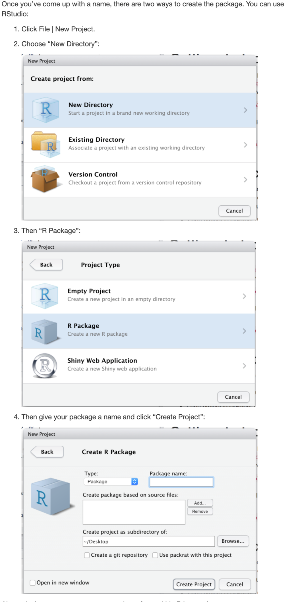
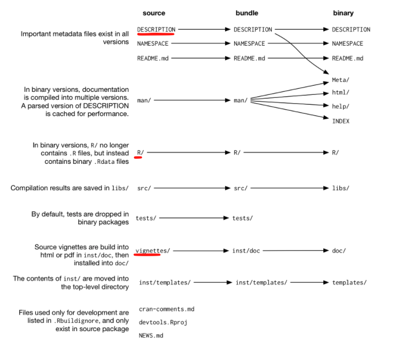
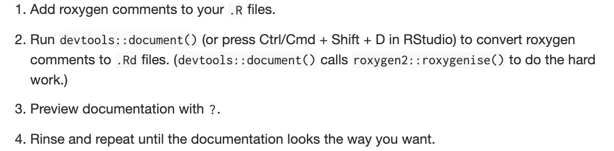
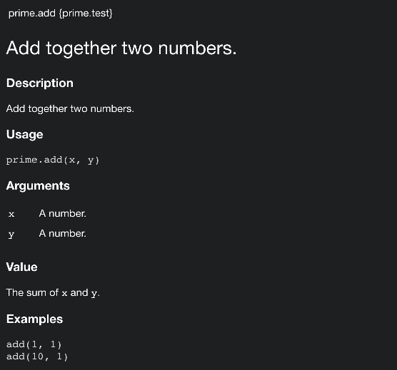

Prime package development document
================

  - [Introduction](#introduction)
      - [Outline of the workflow](#outline-of-the-workflow)
      - [Useful resource](#useful-resource)
  - [Create a package in R](#create-a-package-in-r)
      - [R packages for development](#r-packages-for-development)
      - [Create a R package](#create-a-r-package)
      - [R package structure](#r-package-structure)
  - [Add functions to your package](#add-functions-to-your-package)
  - [Document the functions](#document-the-functions)
  - [Add data set](#add-data-set)
  - [Add your package to the **`prime.master`**
    package](#add-your-package-to-the-prime.master-package)

# Introduction

In this document, I summarize a simplifed workflow of the R package.

## Outline of the workflow

The outline is the following:

1.  Create the framework of a package
    
    1.  Add functions, data
    2.  Add documents for your functions, data, and package  
    3.  Update the package

2.  Add the package into the **`prime.master`** package

## Useful resource

There are many useful articles and books for R package development. The
followings are some I’m using:

  - [Writing an R package from
    scratch](https://hilaryparker.com/2014/04/29/writing-an-r-package-from-scratch/).
    In this article, the author gives a small and quick guidence for how
    to create a package. If you don’t bulid any package before, you can
    just follow this article and you will create you own package within
    10 minutes.

  - [R packages by Hadley Wickham](http://r-pkgs.had.co.nz/intro.html).
    In this book the author breaks the R packages into several parts and
    gives details introduction and descriptions. This document is based
    on the structure of this book.

  - [Object
    documentation](http://r-pkgs.had.co.nz/man.html#text-formatting).
    Besides the code, documentation is also very important. This website
    also introduces how to write document for a function.

# Create a package in R

## R packages for development

  - `devtools` for package development
  - `roxygen2` for package document

<!-- end list -->

``` r
install.packages("devtools")
library("devtools")
devtools::install_github("klutometis/roxygen")
library(roxygen2)
```

## Create a R package



Note that if you have installed `devtools` package. You can just run the
following code

``` r
devtools::create("~/Desktop/prime.test")
```

After running those code, R will create a folder with your package name,
which is the `prime.test` in this case.

## R package structure



# Add functions to your package

After you create a package, you can copy all of your functions into the
`R` folder. Note that you can use the [class
system](https://www.datamentor.io/r-programming/object-class-introduction/)
in R, such as `S3` or `S4` for your package, so that your package will
be efficient and elgent in terms of the code structure. However, I’m not
an expert on this topic, so I may not talk too much of it in this
document. Further details of the class system of R can be found in
[here](https://rstudio-education.github.io/hopr/s3.html#the-s3-system).

# Document the functions

Documentation is important for a package. The good news is that
`roxygen2` package can help us to add help documents in a simple way.
Following is the workflow



Following is a R script of a function with help document:

``` r
#' Add together two numbers.
#'
#' @param x A number.
#' @param y A number.
#' @return The sum of \code{x} and \code{y}.
#' @examples
#' add(1, 1)
#' add(10, 1)

#' @import MASS
#' @export

prime.add <- function(x, y) {
  x + y
}
```

Note that

  - `#'` is the syntax of `roxygen2` to add items in the help document
    of a function.  
  - `@param` means the details of a function input and `@return` is the
    details for the output
  - `@import` is for any libraries the function are depending on, so
    that you *don’t need to load* them inside your function
  - `@export` means this function can be seen after you install the
    package. For some situation, you may want a function as invisible,
    then you just do not add the `@export` in the script.

Further details of the documentation syntax can be found in
[here](http://r-pkgs.had.co.nz/man.html#text-formatting).

After editing the script, you can run the following code to update the
help documents of your pacakge.

``` r
devtools::document("~/Desktop/prime.test/")
devtools::install("~/Desktop/prime.test/")
```

The help document looks like the following



# Add data set

# Add your package to the **`prime.master`** package
