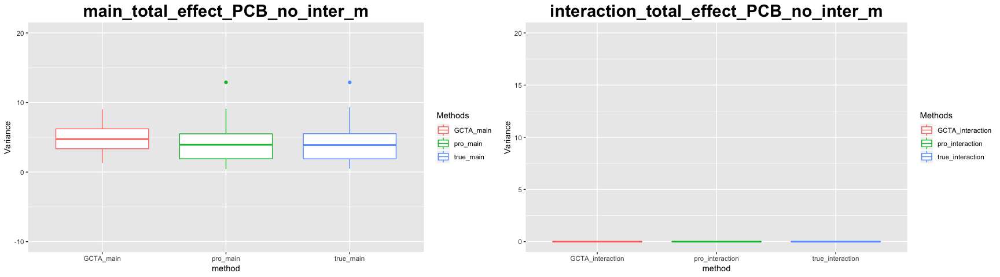
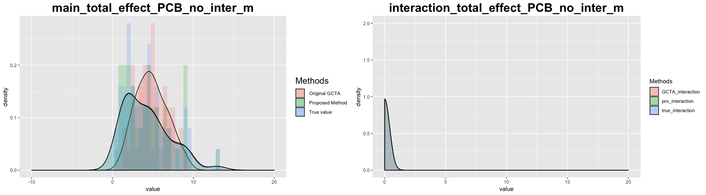
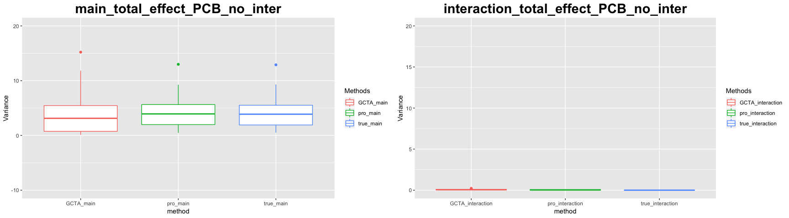
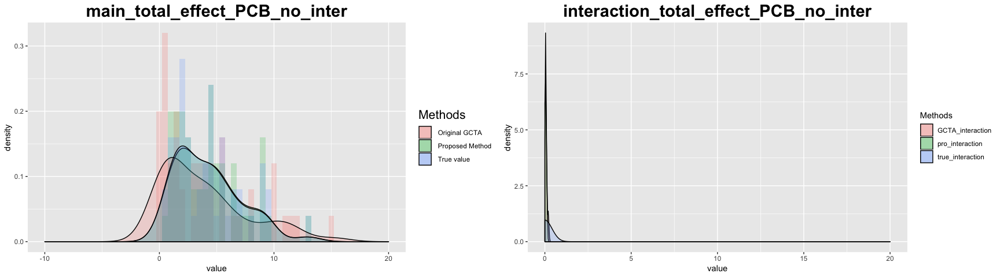
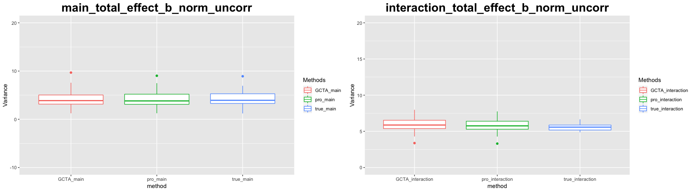
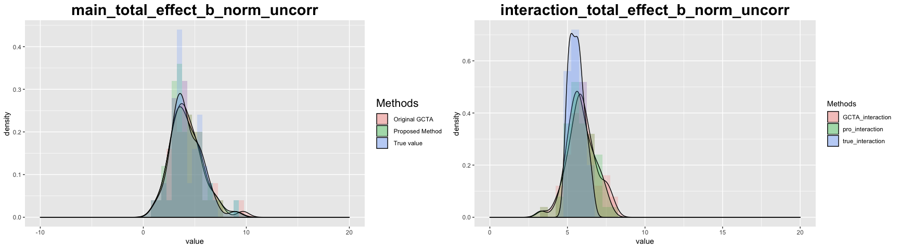
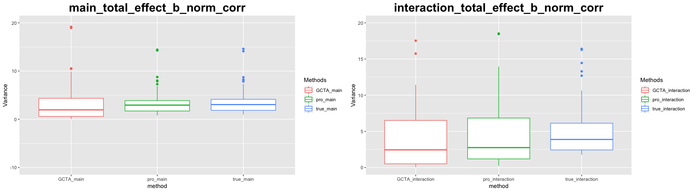
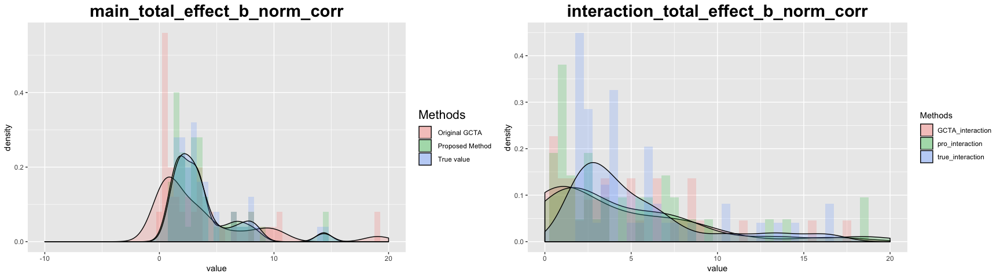
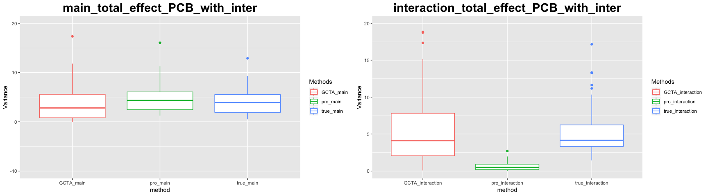
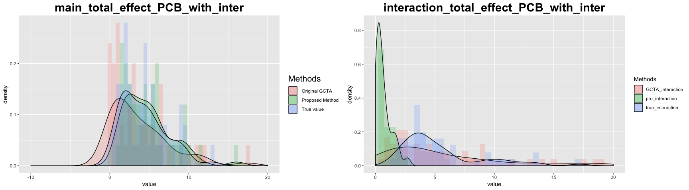

# Reproduce the proposal's result with different $\beta's$ values

- The following 5 simulation situations are trying to mimic the results from the proposal. The only difference is that simulations runs on 50 different beta's values, so that we can have an overall evaluation of the proposed and original method.
- The covariates are transformed by their ranks.
- The core of my code generating the simuation results are also from the propsal.
- Based on the results of the first 4 situations, both methods work fine. It seems that the code can reproduce the results from the proposal. 
- At the last situation, we found that the proposed method seems have a even larger bias than the original GCTA method.


## Signal is generated by PCB data with no intercation (no intercation terms in the fitting model) 


```
## 
## Attaching package: 'MASS'
```

```
## The following object is masked from 'package:dplyr':
## 
##     select
```

```
## 
## Attaching package: 'foreach'
```

```
## The following objects are masked from 'package:purrr':
## 
##     accumulate, when
```

```
## Loading required package: rngtools
```

```
## Loading required package: pkgmaker
```

```
## Loading required package: registry
```

```
## 
## Attaching package: 'pkgmaker'
```

```
## The following object is masked from 'package:base':
## 
##     isFALSE
```

```
## Loading required package: iterators
```

```
## Loading required package: parallel
```

<table class="table" style="width: auto !important; margin-left: auto; margin-right: auto;">
<caption>Table 1: MSE of estimated varaince with PCB data without intercation</caption>
 <thead>
  <tr>
   <th style="text-align:left;">   </th>
   <th style="text-align:right;"> GCTA_main </th>
   <th style="text-align:right;"> GCTA_interaction </th>
   <th style="text-align:right;"> pro_main </th>
   <th style="text-align:right;"> pro_interaction </th>
  </tr>
 </thead>
<tbody>
  <tr>
   <td style="text-align:left;"> MSE </td>
   <td style="text-align:right;"> 7.800384 </td>
   <td style="text-align:right;"> 0 </td>
   <td style="text-align:right;"> 0.0137538 </td>
   <td style="text-align:right;"> 0 </td>
  </tr>
</tbody>
</table>
- In the Table 1, "GCTA_main" and "GCTA_interaction" stands for the estimation of GCTA method. 
- "pro_main" and "pro_interaction" stand for the estimation of proposed method. 
- MSE is calculated by $\sum(\sigma^2_{estimation} - \sigma^2_{true})^2/n$
- n in our case is 50






## Signal is generated by PCB data with no intercation (intercation terms in the fitting model) 

<table class="table" style="width: auto !important; margin-left: auto; margin-right: auto;">
<caption>Table 2: MSE of estimated varaince with PCB data without intercation</caption>
 <thead>
  <tr>
   <th style="text-align:left;">   </th>
   <th style="text-align:right;"> GCTA_main </th>
   <th style="text-align:right;"> GCTA_interaction </th>
   <th style="text-align:right;"> pro_main </th>
   <th style="text-align:right;"> pro_interaction </th>
  </tr>
 </thead>
<tbody>
  <tr>
   <td style="text-align:left;"> MSE </td>
   <td style="text-align:right;"> 2.320332 </td>
   <td style="text-align:right;"> 0.0066383 </td>
   <td style="text-align:right;"> 0.0195048 </td>
   <td style="text-align:right;"> 0.2886175 </td>
  </tr>
</tbody>
</table>






## Signal is generated by covariates Simulated from an __uncorrelated__ Multivariate Normal distribution

- the covariate is generated by a normal distribution i.e. $x \sim N(0, I_p)$, where $p = 34$

<table class="table" style="width: auto !important; margin-left: auto; margin-right: auto;">
<caption>Table 3: MSE of estimated varaince with PCB data without intercation</caption>
 <thead>
  <tr>
   <th style="text-align:left;">   </th>
   <th style="text-align:right;"> GCTA_main </th>
   <th style="text-align:right;"> GCTA_interaction </th>
   <th style="text-align:right;"> pro_main </th>
   <th style="text-align:right;"> pro_interaction </th>
  </tr>
 </thead>
<tbody>
  <tr>
   <td style="text-align:left;"> MSE </td>
   <td style="text-align:right;"> 0.1642786 </td>
   <td style="text-align:right;"> 0.5637613 </td>
   <td style="text-align:right;"> 0.1194212 </td>
   <td style="text-align:right;"> 0.4333698 </td>
  </tr>
</tbody>
</table>






## Signal is generated by covariates Simulated from an __correlated__ Multivariate Normal distribution

- the covariate is generated by a normal distribution i.e. $x \sim N(0, \Sigma_p)$, where all un-diagonal elements of $\Sigma_p$ are equal to 2


<table class="table" style="width: auto !important; margin-left: auto; margin-right: auto;">
<caption>Table 4: MSE of estimated varaince with PCB data without intercation</caption>
 <thead>
  <tr>
   <th style="text-align:left;">   </th>
   <th style="text-align:right;"> GCTA_main </th>
   <th style="text-align:right;"> GCTA_interaction </th>
   <th style="text-align:right;"> pro_main </th>
   <th style="text-align:right;"> pro_interaction </th>
  </tr>
 </thead>
<tbody>
  <tr>
   <td style="text-align:left;"> MSE </td>
   <td style="text-align:right;"> 2.418355 </td>
   <td style="text-align:right;"> 22.03619 </td>
   <td style="text-align:right;"> 0.1101667 </td>
   <td style="text-align:right;"> 9.108719 </td>
  </tr>
</tbody>
</table>






## Signal is generated by PCB data with __intercation__ 

<table class="table" style="width: auto !important; margin-left: auto; margin-right: auto;">
<caption>Table 5: MSE of estimated varaince with PCB data without intercation</caption>
 <thead>
  <tr>
   <th style="text-align:left;">   </th>
   <th style="text-align:right;"> GCTA_main </th>
   <th style="text-align:right;"> GCTA_interaction </th>
   <th style="text-align:right;"> pro_main </th>
   <th style="text-align:right;"> pro_interaction </th>
  </tr>
 </thead>
<tbody>
  <tr>
   <td style="text-align:left;"> MSE </td>
   <td style="text-align:right;"> 2.362527 </td>
   <td style="text-align:right;"> 13.97753 </td>
   <td style="text-align:right;"> 1.12028 </td>
   <td style="text-align:right;"> 33.7454 </td>
  </tr>
</tbody>
</table>





